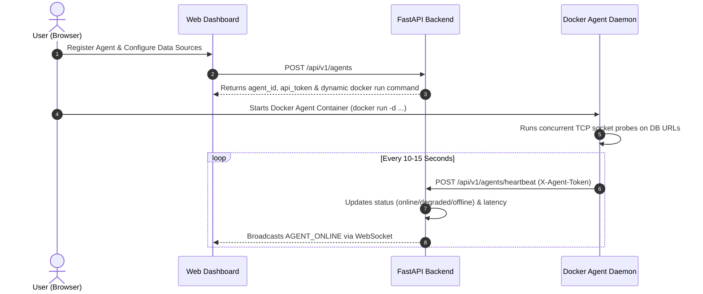
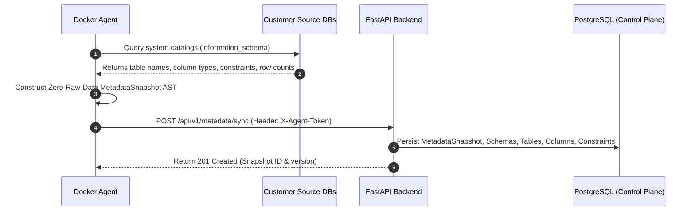
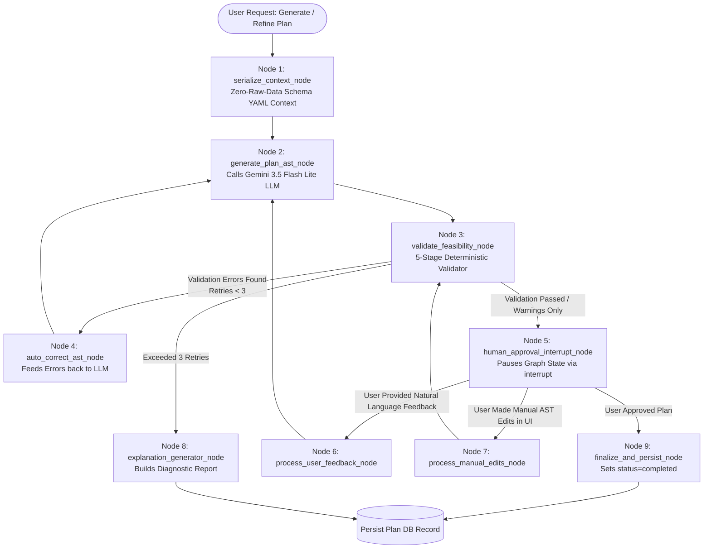
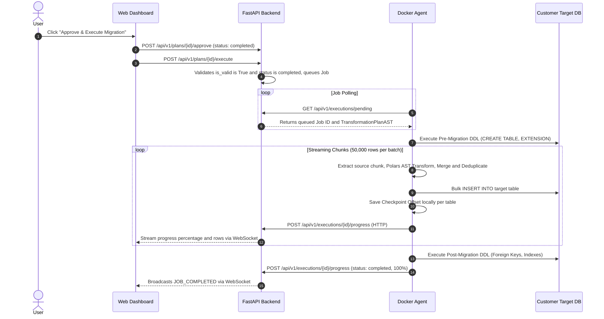

# Architecture Specification — Migraflow Platform

Welcome to the **Migraflow** architecture guide! This document provides a comprehensive, implementation-accurate overview of the platform's architectural principles, components, module responsibilities, end-to-end execution flows, and communication protocols.

---

## 1. Core Architectural Philosophy

The platform decouples **transformation reasoning (Control Plane)** from **transformation execution (Data Plane)** under a strict **Zero Raw Data Ingestion Policy**.

```text
 ┌────────────────────────────────────────────────────────────────────────────────────────┐
 │                              CONTROL PLANE (Cloud / Backend API)                       │
 │                                                                                        │
 │   ┌──────────────────────┐      ┌─────────────────────────┐      ┌──────────────────┐  │
 │   │  Web UI (Next.js)    │ <──> │  FastAPI Backend API    │ <──> │  PostgreSQL DB   │  │
 │   │  (Visual Blueprint,  │ (WS) │  (Auth, Metadata Store, │      │  (Control Plane  │  │
 │   │   Progress & HITL)   │      │   LangGraph Engine)     │      │   Metadata Only) │  │
 │   └──────────────────────┘      └────────────┬────────────┘      └──────────────────┘  │
 └──────────────────────────────────────────────┼─────────────────────────────────────────┘
                                                │ HTTPS REST API
                                                │ (X-Agent-Token Authentication)
                                                │ *ZERO Raw Customer Data Ever Transferred*
 ┌──────────────────────────────────────────────┼─────────────────────────────────────────┐
 │                                              ▼                                         │
 │                               ON-PREMISE DATA PLANE (Customer VPC)                     │
 │                                                                                        │
 │   ┌────────────────────────────────────────────────────────────────────────────────┐   │
 │   │                         Docker Agent Daemon (apps/agent)                       │   │
 │   │                                                                                │   │
 │   │   ┌───────────────────────────────┐     ┌──────────────────────────────────┐   │   │
 │   │   │  AgentMetadataEngine          │     │  ExecutionOrchestrator           │   │   │
 │   │   │  (Catalog Introspection:      │     │  (Chunked ETL, Polars AST        │   │   │
 │   │   │   Postgres, MySQL, MongoDB)   │     │   Transforms, Bulk Loader)       │   │   │
 │   │   └──────────────┬────────────────┘     └────────────────┬─────────────────┘   │   │
 │   └──────────────────┼───────────────────────────────────────┼─────────────────────┘   │
 │                      ▼                                       ▼                         │
 │           ┌──────────────────────┐                ┌──────────────────────┐             │
 │           │   Source Databases   │                │   Target Database    │             │
 │           │ (Postgres, MySQL, …) │                │ (Postgres, MySQL, …) │             │
 │           └──────────────────────┘                └──────────────────────┘             │
 └────────────────────────────────────────────────────────────────────────────────────────┘
```

### Key Architectural Pillars:

1. **Zero Raw Data Ingestion**:
   - Customer records **never** leave the customer's local infrastructure or VPC.
   - The Control Plane only receives sanitized structural metadata ASTs (schema names, table definitions, column types, row count estimates, constraints, and foreign keys).

2. **Deterministic Execution (No Dynamic Code Eval)**:
   - AI models (Gemini 3.5 Flash Lite) are used **strictly** to reason about schema semantics and output a strongly typed Abstract Syntax Tree (`TransformationPlanAST`).
   - ETL execution is 100% deterministic (powered by Polars, SQLAlchemy, and DuckDB). Dynamic evaluation (`eval()`, `exec()`, arbitrary Python code execution) is strictly forbidden.

3. **Stateful Human-in-the-Loop (HITL) Reasoning**:
   - Migration plans require explicit human review and approval before execution can be scheduled.
   - Users can provide natural language refinement prompts or manually edit column mappings, triggering deterministic re-validation through LangGraph.

4. **Resumable Chunked Streaming & Bounded-Memory Merges**:
   - Data extraction and target loading stream in bounded memory chunks (50,000 rows per batch) with source-scoped checkpoint state persistence (`checkpoint_{job_id}_{target_table}_{source_identifier}_{source_table}.json`). If an agent crashes or restarts, migration resumes seamlessly from the exact source offset without duplicate inserts.
   - Multi-source table merges stage intermediate chunks into a local DuckDB file database (`staging_{job_id}_{target_table}.duckdb`) on disk, streaming deduplicated final batches in bounded memory to prevent Out-Of-Memory (OOM) failures.

---

## 2. System Components & Folder Breakdown

The repository is organized as a multi-package architecture:

```text
ai-data-migration-platform/
├── apps/
│   ├── api/                     # Control Plane Backend (FastAPI, LangGraph, PostgreSQL)
│   │   ├── alembic/             # Database schema migrations (001 through 011)
│   │   ├── app/
│   │   │   ├── core/            # Config, DB connections, Redis, WebSockets, Logging
│   │   │   └── modules/
│   │   │       ├── users/       # Auth, JWT, Google OAuth 2.0
│   │   │       ├── agents/      # Agent lifecycle, tokens, heartbeat & docker run generator
│   │   │       ├── sources/     # Logical Data Sources registry per agent
│   │   │       ├── metadata/    # Schema snapshot catalog & sync endpoints
│   │   │       ├── migration_plans/ # LangGraph 9-Node Engine, Gemini LLM, Validator & Plan Versions
│   │   │       └── execution/   # Job queue, state machine, progress, AI diagnosis & checkpoints
│   │   ├── tests/               # Unit, integration, and security test suites
│   │   └── pyproject.toml       # Python 3.11+ dependencies managed via Poetry
│   │
│   ├── agent/                   # On-Premise Docker Agent (Data Plane Runner)
│   │   ├── main.py              # Agent daemon: socket diagnostics, dynamic heartbeats, job polling
│   │   ├── metadata_engine.py   # Native SQL catalog introspection engine (Zero Raw Data)
│   │   ├── engine/              # Modular ETL Execution Engine Package:
│   │   │   ├── orchestrator.py  # Central ExecutionOrchestrator driving the ETL pipeline
│   │   │   ├── connectors/      # SourceConnectorFactory (PostgreSQL, MySQL, MongoDB, Keyset pagination)
│   │   │   ├── transformers/    # ASTTransformer (Polars expressions, type casting, PK strategies)
│   │   │   ├── staging/         # TableMerger & DuckDB persistent staging for multi-source joins
│   │   │   ├── writers/         # TargetWriterFactory (PostgreSQL, MySQL, MongoDB, SQLite bulk insert)
│   │   │   ├── ddl/             # DDLExecutor (Pre/post migration DDL, constraint/index management)
│   │   │   ├── checkpoint.py    # CheckpointManager (source-scoped offset tracking & crash recovery)
│   │   │   ├── db.py            # Cached SQLAlchemy engines (_get_engine, dispose_all_engines)
│   │   │   └── progress_reporter.py # Throttled HTTPS progress reporting to Control Plane
│   │   ├── execution_engine.py  # Backward-compatible re-export facade of ExecutionOrchestrator
│   │   ├── Dockerfile           # Minimal Python runtime container for customer deployment
│   │   └── pyproject.toml       # Agent dependencies (Polars, DuckDB, SQLAlchemy, PyMySQL, psycopg2)
│   │
│   └── web/                     # Web UI Frontend (Next.js, React, TailwindCSS / CSS)
│
├── docs/                        # Architecture & system specifications
├── DECISIONS.md                 # Architecture Decision Records (ADRs)
└── EXECUTION_FLOW.md            # Detailed function-level call trees & state machines
```

---

## 3. Detailed Module Responsibilities

### 3.1 Control Plane Backend (`apps/api/app/modules/`)

| Module | Primary Responsibility | Key Files |
| :--- | :--- | :--- |
| **`users`** | Handles user registration, password hashing (bcrypt), JWT session cookies, and Google OAuth 2.0 authentication. | `users_routes.py`, `users_services.py`, `users_models.py` |
| **`agents`** | Manages Docker Agent identity, generates secure SHA-256 API tokens, receives dynamic heartbeat diagnostics (20s active / 300s standby), handles emergency fatal error reports (`POST /api/v1/agents/fatal-error`), and dynamically builds custom `docker run` commands with pre-filled environment variables. | `agents_routes.py`, `agents_services.py`, `agents_command_generator.py` |
| **`sources`** | Registers logical data sources (PostgreSQL, MySQL, MongoDB, CSV, Excel, Parquet) attached to an agent and tracks live connectivity health. | `sources_routes.py`, `sources_services.py`, `sources_models.py` |
| **`metadata`** | Ingests structural metadata snapshots from agents (`POST /api/v1/metadata/sync`), persisting versioned tables, columns, constraints, and relationships. | `metadata_routes.py`, `metadata_services.py`, `metadata_models.py` |
| **`migration_plans`** | Houses the **LangGraph 9-Node Agent Engine**, **Gemini 3.5 Flash Lite prompt generator**, **5-Stage Migration Feasibility Validator**, and **Immutable Plan Versioning Engine** (`GET /versions`, `POST /restore`). Manages plan generation, feedback refinement loops, and approval gating. | `migration_plans_graph.py`, `migration_plans_llm.py`, `migration_plans_validator.py`, `migration_plans_ast.py`, `migration_plans_services.py` |
| **`execution`** | Manages migration job queues, enforces approval validation guards (`is_valid=True`, `status='completed'`), receives chunked ETL progress, orchestrates AI automated root-cause failure diagnosis (`ai_diagnosis`), and stores row-level diagnostic error logs. | `execution_routes.py`, `execution_services.py`, `execution_models.py` |

---

### 3.2 On-Premise Docker Agent (`apps/agent/`)

| Component | Responsibility |
| :--- | :--- |
| **`main.py`** | Agent daemon process. Runs startup multi-threaded TCP socket connectivity tests against configured database URLs (`SRC_*_URL`, `DEST_*_URL`), runs dynamic background heartbeat loop with adaptive pacing (20s active vs 300s standby), responds to backend control directives (`ENTER_IDLE_MODE`, `RESUME_ACTIVE_MODE`, `SHUTDOWN`), reports container fatal stopping errors via emergency endpoint, triggers schema introspection, and polls for pending execution jobs (`GET /api/v1/agents/tasks`). |
| **`metadata_engine.py`** (`AgentMetadataEngine`) | Queries native database system catalogs (`information_schema.tables`, `information_schema.columns`, `table_constraints`, `pg_class`, `sqlite_master`) without reading user data rows. Builds structured JSON snapshot payloads and syncs via `POST /api/v1/metadata/sync`. |
| **`engine/orchestrator.py`** (`ExecutionOrchestrator`) | Central ETL execution pipeline orchestrator. Coordinates pre-migration DDL, source stream reading, Polars transformations, multi-source DuckDB staging merges, target loading, checkpoint commits, post-migration DDL, and connection pool cleanup via `dispose_all_engines()`. |
| **`engine/connectors/source_factory.py`** (`SourceConnectorFactory`) | Reads source data in 50,000-row streaming chunks with SQL keyset pagination (`WHERE id > :last_id ORDER BY id LIMIT :chunk_size`) and MongoDB `_id` pagination. Wraps database connection drops in descriptive `SourceReadError`. |
| **`engine/transformers/ast_transformer.py`** (`ASTTransformer`) | Applies in-memory Polars transformations: strict type casting with zero timestamp fabrication, 4 PK strategies (`keep_original`, `autoincrement_offset`, `prefix_id`, `uuid_v4_rekey`), column renames, and residual unmapped field capture into `extra_attributes` JSON. |
| **`engine/staging/duckdb_staging.py`** (`TableMerger`) | Merges multi-source tables via bounded-memory DuckDB local staging files (`staging_{job_id}_{target_table}.duckdb`). Preserves staging state across container crashes and streams deduplicated final chunks directly to target writer. |
| **`engine/writers/target_writer.py`** (`TargetWriterFactory`) | Performs high-performance bulk insertions with fast (<3s) proactive connectivity pre-checks (`engine.connect()`), rowcount conflict verification, and PyMongo `BulkWriteError` handling. |
| **`engine/checkpoint.py`** (`CheckpointManager`) | Persists row offsets locally per table and per source (`checkpoint_{job_id}_{target_table}_{source_id}_{source_table}.json`) for crash resilience and one-click resumption. |
| **`engine/db.py`** | Centralized database connection engine cache (`_get_engine(url)`) with explicit disposal (`dispose_all_engines()`) to prevent connection pool exhaustion and file lock leaks. |
| **`engine/progress_reporter.py`** (`ProgressReporter`) | Throttled HTTPS progress reporter sending processed rows, throughput metrics, and error stack traces to the Control Plane. |

---

## 4. End-to-End Application Workflows

### 4.1 Workflow 1: Agent Setup & Live Diagnostic Heartbeats



---

### 4.2 Workflow 2: Zero-Raw-Data Schema Introspection



---

### 4.3 Workflow 3: AI Migration Plan Generation & Validation (LangGraph 9-Node Engine)

When the user requests an AI plan generation (`POST /api/v1/plans/generate`), the request is executed by the stateful **LangGraph StateGraph** (`migration_plans_graph.py`):



#### The 5-Stage Feasibility Validator Checks:
1. **Stage A (Source Table Check)**: Every source table referenced in AST exists in the metadata snapshot.
2. **Stage B (Source Column Check)**: Every source column mapped exists in the source table schema.
3. **Stage C (Data Type Casting Check)**: Flag illegal casts (e.g. `VARCHAR` ➔ `INTEGER` without sanitization).
4. **Stage D (Foreign Key Reference Check)**: Foreign keys in `post_migration_ddl` reference valid target tables.
5. **Stage E (Deduplication Key Check)**: Deduplication keys reference real mapped target columns.

---

### 4.4 Workflow 4: Execution & Resumable Streaming ETL



---

## 5. Communication Protocols & Security Model

The platform is designed around a **Zero-Knowledge Security Architecture**, guaranteeing that database credentials and sensitive customer data never touch the cloud Control Plane, and that multi-agent communication is cryptographically secured and strictly isolated.

### 5.1 Communication Protocols Overview

| Channel | Protocol | Auth Mechanism | Payload / Purpose |
| :--- | :--- | :--- | :--- |
| **Agent ➔ Backend** | **HTTPS (REST)** | `X-Agent-Token` (SHA-256 hash verified) | Heartbeats, schema snapshots, job polling, ETL progress reports |
| **Backend ➔ Web UI** | **WebSockets (`wss://`)** | JWT Bearer Token | Real-time progress bars, stage transitions, agent online status |
| **Web UI ➔ Backend** | **HTTPS (REST)** | HTTP-only JWT Cookie (`access_token`) | CRUD operations, plan generation, HITL approval |
| **Agent ➔ Customer DBs** | **Native SQL TCP** | Local connection strings in Docker environment | Reading source rows, bulk writing target rows |

---

### 5.2 How Agent Communication Security Is Guaranteed

```text
 ┌────────────────────────────────────────────────────────────────────────────────────────┐
 │                              SECURITY ARCHITECTURE OVERVIEW                            │
 │                                                                                        │
 │  1. Transport Security: HTTPS / TLS 1.3 (End-to-End Encryption, No Packet Sniffing)   │
 │                                                                                        │
 │  2. Cryptographic Token Hashing:                                                       │
 │     Agent Container                      Control Plane Backend (FastAPI)               │
 │     [X-Agent-Token: raw_secret] ──HTTPS──► SHA-256(raw_secret) ──► DB Hash Lookup      │
 │     (Plaintext never stored)               (Constant-time verification)                │
 │                                                                                        │
 │  3. Multi-Agent Cryptographic Isolation:                                               │
 │     • Job Polling:    SELECT FROM migration_jobs WHERE agent_id = current_agent.id     │
 │     • Progress Update: Enforces job.agent_id == current_agent.id (404 on mismatch)     │
 │                                                                                        │
 │  4. Zero-Knowledge Guarantees:                                                         │
 │     • DB Passwords:   Reside ONLY on customer host machine (never in Control Plane DB) │
 │     • Customer Data:  Extracted & transformed in local memory (never sent to Cloud)    │
 └────────────────────────────────────────────────────────────────────────────────────────┘
```

#### 1. Transport Layer Security (TLS / HTTPS)
- All agent-to-backend traffic occurs strictly over encrypted **HTTPS (TLS 1.2 / TLS 1.3)**.
- Encrypts all request headers (`X-Agent-Token`), query payloads, and responses, preventing Man-in-the-Middle (MITM) attacks, token interception, and eavesdropping.

#### 2. Cryptographic Token Generation & One-Way Hashing
- When a user registers an Agent, the Control Plane generates a cryptographically secure, high-entropy API token (e.g. 32-byte URL-safe string).
- **Zero Plaintext Storage**: The backend **never stores plaintext tokens** in the PostgreSQL database. Only the one-way **SHA-256 hex digest** (`agents.api_token_hash`) is persisted.
- On every incoming request, the FastAPI dependency (`get_current_agent` in `agents_dependencies.py`) hashes the incoming token and looks up the agent by its hash:
  ```python
  token_hash = hashlib.sha256(raw_token.strip().encode("utf-8")).hexdigest()
  stmt = select(Agent).where(Agent.api_token_hash == token_hash)
  ```
- If a token is compromised or revoked in the UI, deleting or updating the hash immediately severs agent access.

#### 3. Multi-Agent Isolation & Prevention of Cross-Agent Collisions
In multi-agent environments (e.g. multiple branch offices, different customer VPCs, or distinct departments):
- **Isolated Task Discovery**: When an agent polls `GET /api/v1/agents/tasks`, the backend filters strictly by the authenticated agent:
  ```python
  stmt = select(MigrationJob).where(
      MigrationJob.agent_id == authenticated_agent.id,
      MigrationJob.status.in_(["queued", "preparing"])
  )
  ```
  *Agent A can never see, receive, or claim tasks belonging to Agent B.*
- **Strict Progress Authorization**: When reporting ETL execution progress (`POST /api/v1/executions/{id}/progress`), the service enforces:
  ```python
  stmt = select(MigrationJob).where(MigrationJob.id == job_id, MigrationJob.agent_id == authenticated_agent.id)
  ```
  *If Agent B attempts to update or alter progress for Agent A's job, the request is rejected with `404 Not Found / Access Denied`.*

#### 4. Zero-Knowledge Credential Architecture
- The Control Plane **never knows, receives, or stores database passwords**.
- Connection strings (`SRC_POSTGRES_URL`, `DEST_MYSQL_URL`) reside **exclusively in the customer's local Docker environment** on their own private infrastructure.
- The Control Plane only stores non-sensitive logical identifiers (`src_postgres`, `dest_mysql`, engine types, and port numbers).

#### 5. Zero Raw Customer Data Transmission
- The agent only sends **sanitized structural metadata** (`information_schema` table names, column data types, row counts) to the backend for AI reasoning.
- Customer rows, PII, and financial records **never leave the local Docker container runtime**. Transformations and bulk insertions happen locally between source and target databases.

#### 6. Agent Liveness Monitoring & Stale Token Invalidation
- The agent sends diagnostic heartbeats every 20 seconds via a dedicated background daemon thread (`start_heartbeat_thread`) in `apps/agent/main.py`.
- If an agent stops heartbeating for > 30 seconds, its status transitions to `offline` or `degraded`, preventing new migration jobs from being scheduled on that agent until connectivity is restored.

#### 7. Backend Stuck-Job Execution Watchdog
- The Control Plane runs a background watchdog service (`ExecutionService.check_stale_jobs`) inside the lifespan loop and on job status reads.
- **Trigger & Threshold**: Queries all `MigrationJob` records in `running` or `preparing` status whose `updated_at` timestamp is older than **5 minutes** (300 seconds).
- **State Transition**: Automatically transitions stale jobs to `status = 'failed'` with an explicit error message (`"Migration job stalled: no progress updates received from agent for over 5 minutes."`). Ensures progress bars never remain frozen indefinitely after container or host crashes.

#### 8. MongoDB Introspection, Majority-Vote Resolution & Residual Capture Guarantees
- **Sampling Strategy**: `MongoDBConnector.introspect_schema` (API) and `AgentMetadataEngine._introspect_mongodb` (Agent) sample up to **100 documents** (or up to 1,000 documents) per collection.
- **Depth-3 Recursive Path Flattening**: Evaluates nested document structures up to `Depth = 3`, generating flattened column specifications (`parent.child.grandchild`).
- **Majority-Vote Data Type Resolution**: For schemaless collections with polymorphic field types, counts occurrence frequencies per BSON type. The highest-frequency type is assigned to `data_type`, while all observed types are documented in `native_data_type` annotations (e.g., `bson(int, string) [coverage: 95.0%]`).
- **Residual Field Capture Guarantee**: At execution time, `ASTTransformer.transform_chunk` identifies all document keys and nested structures missing from explicit AST column mappings and serializes them into a catch-all `extra_attributes` JSON column, guaranteeing **zero data loss** for unmapped or dynamic document attributes.

#### 9. Dynamic Agent Heartbeat, Standby Mode & Container Control Directives
- **Adaptive Heartbeat Pacing**: The agent runs a dynamic background heartbeat loop (`apps/agent/main.py`). When actively processing jobs or newly launched, it heartbeats every 20 seconds. If idle with no assigned tasks for over 10 minutes, it automatically transitions to **Standby Mode** (300-second / 5-minute heartbeat interval), minimizing network chatter and resource utilization.
- **Control Directives**: The backend heartbeat response (`POST /api/v1/agents/heartbeat`) sends control directives (`action`: `ENTER_IDLE_MODE`, `RESUME_ACTIVE_MODE`, `SHUTDOWN`), allowing the Control Plane to coordinate agent power states and graceful container shutdowns.
- **Emergency Fatal Error Reporting**: If the agent container encounters an unrecoverable fatal error during startup or execution (e.g., missing mandatory credentials, network partition), it sends an immediate notification via `POST /api/v1/agents/fatal-error` before terminating, recording the exact error message and category in `agents.last_error` and `agents.error_category`.

#### 10. Fast Target DB Connectivity Pre-Check & Engine Cache
- **Proactive Target Probe**: Before starting chunk extraction or streaming rows, `TargetWriterFactory` executes a fast `engine.connect()` check with a 3-second timeout.
- **Instant Error Root-Causing**: This pre-check distinguishes a completely unreachable target (auth failure, incorrect port, offline host) from a per-row data or schema mismatch. If the target is unreachable, the job fails immediately with a clear error rather than retrying thousands of rows slowly.
- **Centralized Engine Cache & Disposal**: SQLAlchemy database engines are managed via `_ENGINE_CACHE` in `apps/agent/engine/db.py`. To prevent connection pool exhaustion and file lock leaks, `ExecutionOrchestrator` guarantees `dispose_all_engines()` is called in a top-level `finally:` block upon job completion, failure, or cancellation.

#### 11. Multi-Source DuckDB Staging Merge Crash Resilience
- **Persistent On-Disk Staging**: For multi-source table joins and merges, intermediate transformed chunks from each source are staged into a dedicated local DuckDB file database (`staging_{job_id}_{target_table}.duckdb`).
- **Per-Source Step Checkpointing**: Each source step persists its own checkpoint (`checkpoint_{job_id}_{target_table}_{source_id}_{source_table}.json`). If the container crashes mid-merge, the DuckDB staging file is preserved. Upon resumption, already-staged sources are detected and skipped, preventing duplicate extraction.
- **Atomic Cleanup on Success**: The staging file is removed only after all rows are successfully merged, deduplicated, and committed to the target database.

#### 12. Immutable Plan Versioning & Rollback Architecture
- **Automatic Version Snapshotting**: Every plan lifecycle transition (initial AI generation via LangGraph Node 9, refinement prompts, manual UI edits) creates an immutable `MigrationPlanVersion` record containing a complete snapshot of the `TransformationPlanAST` and changelog metadata.
- **Zero-Downtime Rollbacks**: The Control Plane maintains `plan.current_version`. Users can inspect full historical blueprints (`GET /api/v1/plans/{id}/versions/{v_num}`) and restore the active plan to any prior version (`POST /api/v1/plans/{id}/versions/{v_num}/restore`) without losing audit history.

#### 13. Zero Timestamp Fabrication Policy
- **Strict Datetime Parsing**: In `apps/agent/engine/transformers/ast_transformer.py`, datetime parsing strictly yields `None` (SQL `NULL`) when encountering missing, empty, or unparseable date values.
- **No Inferred Timestamps**: The engine never silently fabricates `datetime.utcnow()` or arbitrary defaults, preserving target schema nullability constraints and data truthfulness.

#### 14. Client-Side Zero-Credential Parameter Substitution Pipeline
- **Zero-Storage Connection Details**: Database connection hostnames, port numbers, usernames, and database names are entered into [`DatabaseConfigForm.tsx`](file:///d:/GitHub/Ai_data_migration_platform/apps/web/components/agents/DatabaseConfigForm.tsx) and kept exclusively in client-side React memory.
- **Shared Substitution Engine**: [`dockerCommandUtils.ts`](file:///d:/GitHub/Ai_data_migration_platform/apps/web/lib/dockerCommandUtils.ts) mirrors the backend's sanitization and collision-suffixing logic (`_2`, `_3`) to replace `<PREFIX_HOST>`, `<PREFIX_PORT>`, `<PREFIX_USER>`, and `<PREFIX_NAME>` directly in browser memory.
- **Strict Password Isolation**: Database passwords are never entered in the browser or sent to the Control Plane API; they remain manual `<..._PASSWORD>` placeholders that the developer supplies in their private terminal.

#### 15. Instant Agent API Token Regeneration & Revocation
- **Cryptographic Rotation**: Calling `POST /api/v1/agents/{id}/regenerate-token` generates a high-entropy `ag_live_...` token, computes its SHA-256 digest, and overwrites `agents.api_token_hash`.
- **Instant Revocation**: Any running container using the previous token fails authentication on its very next heartbeat or task poll with `HTTP 401 Unauthorized ("Invalid or revoked Agent API token")`.
- **Single-Exposure Secret**: The new raw token is returned once in the API response embedded in fresh Docker commands; the backend never stores plaintext tokens.

#### 16. Dry Run Simulation Mode (Zero Target Mutation)
- **Schema & AST Stress-Testing**: Allows users to run complete end-to-end migrations in simulation mode (`is_dry_run = true`).
- **Data Plane Behavior**: The agent extracts source chunks, runs Polars AST expression transformations, and tests type casts. However, it rolls back target transactions or skips destructive table creation, ensuring target databases remain completely untouched while verifying that data pipelines execute without errors.
- **Status Reporting**: The agent reports final status `dry_run_completed`, preserving existing checkpoints for live execution.

#### 17. Target-State Pre-Execution Safety & 5-Factor Readiness Scoring
- **Target Table Collision Probe**: Preflight inspection detects whether target tables already exist and contain existing records (`has_existing_data`), preventing accidental data corruption.
- **Deterministic Readiness Breakdown**: Replaces arbitrary single percentage confidence metrics with a transparent 5-vector readiness model:
  1. *Syntax & AST Validity* (AST structure conforms to schema).
  2. *Primary Key Coverage* (Source PKs properly mapped to target PKs).
  3. *Type Compatibility* (Data types align without lossy truncation).
  4. *Constraint Preservation* (Unique constraints & foreign keys preserved).
  5. *Target State Readiness* (Target table existence & empty state verified).

---

## 6. Observability & Tracing (LangSmith)

The Control Plane integrates with **LangSmith** for full execution observability across LangGraph nodes and Gemini LLM reasoning steps:

- **Environment Variables**:
  - `LANGCHAIN_TRACING_V2=true`
  - `LANGCHAIN_API_KEY=lsv2_...`
  - `LANGCHAIN_PROJECT="Data migration platform"`
  - `LANGCHAIN_ENDPOINT="https://api.smith.langchain.com"`
- **Traced Components**:
  - Full StateGraph node transitions (`serialize_context` ➔ `generate_plan_ast` ➔ `validate_feasibility`).
  - LLM prompts, temperature, token counts, and raw JSON AST outputs.
  - Feasibility validation error feedback loops.

---

## 7. Database Migrations (Alembic)

The Control Plane database schema is versioned using Alembic in `apps/api/alembic/versions/`:

- `001_initial_control_plane_schema.py`: Initial users, connections, plans, jobs, metadata catalog.
- `002_add_agents_and_agent_relationships.py`: Agent entities and relationships.
- `003_add_google_auth_to_users.py`: Google OAuth 2.0 fields on `users`.
- `004_update_database_architecture_agent_centric.py`: Decouples connections into Agent-centric `data_sources` and N:M `migration_plan_snapshots`.
- `005_add_agent_tokens_and_datasource_diagnostics.py`: Agent API token hashing and connection diagnostics (`last_error`, `status`).
- `006_add_feasibility_and_langgraph_to_plans.py`: Adds `is_valid`, `validation_errors`, and `langgraph_thread_id` to `migration_plans`.
- `007_add_ai_diagnosis_to_migration_jobs.py`: Adds `ai_diagnosis` JSON column to `migration_jobs` for automated root-cause failure analysis.
- `008_add_migration_plan_versions.py`: Creates `migration_plan_versions` table and adds `current_version` integer to `migration_plans`.
- `009_add_idle_since_to_agents.py`: Adds `idle_since` timestamp column to `agents` for dynamic heartbeat standby tracking.
- `010_add_error_fields_to_agents.py`: Adds `last_error`, `error_category`, and `last_error_at` diagnostic columns to `agents`.
- `011_add_is_dry_run_to_migration_jobs.py`: Adds `is_dry_run` boolean column (default `false`) to `migration_jobs` to track dry-run simulation executions.

---

## 8. Summary for New Contributors

When exploring or modifying the codebase, remember the **Golden Rules**:
1. **Never read customer data in the Control Plane**: Only metadata and AST plans live in `apps/api`.
2. **Deterministic execution only**: Any new transformation feature must be added as a typed Pydantic spec in `migration_plans_ast.py` and executed deterministically in `apps/agent/engine/` using Polars/DuckDB.
3. **Always preserve HITL approval**: No migration job may execute without passing through `human_approval_interrupt_node` and having `is_valid == True` and `status == 'completed'`.
4. **Modular Agent Engine Separation**: Maintain strict separation of concerns within `apps/agent/engine/`. Connectors (`connectors/`), transformers (`transformers/`), staging (`staging/`), target writers (`writers/`), and checkpoints (`checkpoint.py`) must remain decoupled.
5. **Connection Pool Discipline & Cleanup**: Always retrieve database engines via `_get_engine(url)` in `engine/db.py` and ensure `dispose_all_engines()` is called in `finally:` blocks to prevent connection leaks.
6. **Zero Timestamp Fabrication**: Never substitute `datetime.utcnow()` or arbitrary fallback values for invalid or NULL source dates. Respect source data nullability.
7. **Phase 1 Supported Connectors Scope**: Focus strictly on relational and document databases (PostgreSQL, MySQL, MongoDB). File-based sources (CSV/Excel) are deprecated from creation forms in Phase 1.
