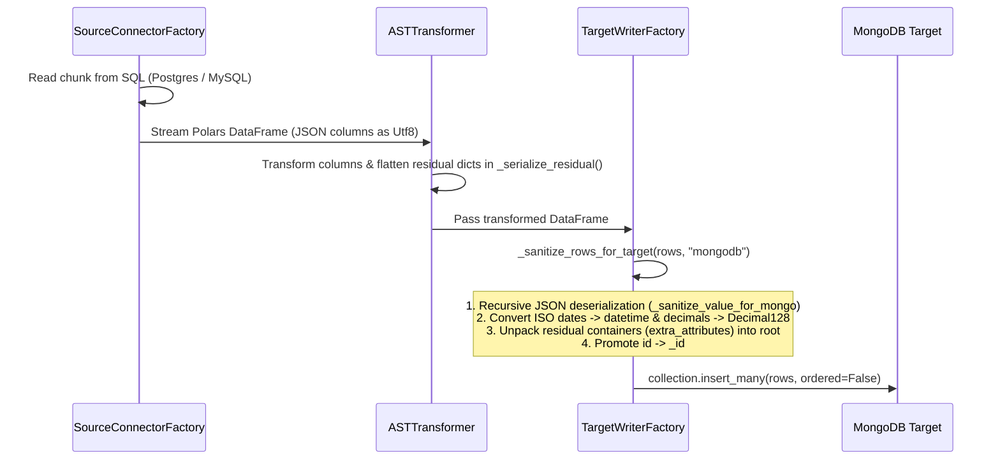

# Execution Flow — Migraflow Platform

## 1. Entry Point

- **Files**:
  - [`apps/web/app/sources/page.tsx`](file:///d:/GitHub/Ai_data_migration_platform/apps/web/app/sources/page.tsx)
  - [`apps/web/app/profiling/page.tsx`](file:///d:/GitHub/Ai_data_migration_platform/apps/web/app/profiling/page.tsx)
  - [`apps/web/app/transformation-plan/page.tsx`](file:///d:/GitHub/Ai_data_migration_platform/apps/web/app/transformation-plan/page.tsx)
  - [`apps/web/app/execution/page.tsx`](file:///d:/GitHub/Ai_data_migration_platform/apps/web/app/execution/page.tsx)
- **Triggers**:
  - Navigating to `/sources` or `/profiling` after registering a Docker agent.
  - Clicking **"Generate AI Migration Plan"** from the Schema Inspector.
  - Opening `/transformation-plan?planId={id}` to review, edit, refine, or approve AI migration blueprints.
  - Clicking **"APPROVE & EXECUTE MIGRATION"** to dispatch the migration job to the local Docker Agent.

## 2. Step-by-Step Execution Sequence

### Phase A: Live Agent Connection Monitoring & Catalog Introspection

1. **Agent List Fetch**: `SourcesPage` invokes `agentService.listAgents()` (`GET /api/v1/agents`) to fetch registered agents.
2. **WebSocket Subscription**: `AgentStatusBanner` connects to `ws://localhost:8000/api/v1/agents/ws/{agentId}?token={token}`.
3. **Live Status Signals**:
   - Agent heartbeat ping emits `AGENT_CONNECTED` / `AGENT_HEARTBEAT` -> Status pill updates to `ONLINE`.
   - Agent introspection sync emits `METADATA_PROFILED` -> Triggers catalog refetch.
4. **Metadata Catalog Rendering**:
   - `SchemaCatalogViewer` invokes `metadataService.getLatestSnapshot(sourceId)` (`GET /api/v1/metadata/sources/{source_id}/latest`).
   - Renders searchable list of tables, estimated row counts, column types, PK/FK attributes, and constraint definitions.

### Phase B: AI Migration Plan Generation & Transformation Blueprinting

1. **Plan Generation Trigger**:
   - User configures target database dialect & optional instructions in `GeneratePlanAction`.
   - Submits `planService.createPlan(agentId, targetConfig)` (`POST /api/v1/plans`).
   - Redirects to `/transformation-plan?planId={plan.id}`.
2. **Transformation Blueprint AST Visualization**:
   - `PlanBlueprintViewer` fetches plan detail via `planService.getPlan(planId)` (`GET /api/v1/plans/{plan_id}`).
   - Checks active job status via `executionService.listUserExecutions()` to mount active job banner if execution is already running.
   - Renders **Execution Order Sequence Timeline** (dependency order), **Table Mapping Matrix**, and **AI Confidence Score**.
3. **AI Plan Refinement & Feasibility Feedback Loop**:
   - User enters natural language prompt (e.g. _"Can we do that same conversion without data loss in 12 tables?"_) in `PlanBlueprintViewer`.
   - Submits `planService.refinePlan(planId, prompt)` (`POST /api/v1/plans/{plan_id}/refine`).
   - `MigrationPlanService.refine_plan()` locks plan row with `with_for_update()` and delegates to `llm_plan_generator.refine()`.
   - LLM evaluates feasibility against source schemas and zero-data-loss rules.
   - If infeasible or rejected (e.g., merging incompatible tables):
     - LLM sets `refinement_feedback.applied = false`, `verdict = 'infeasible_rejected'`, and provides detailed technical explanation.
     - Preserves the safe 14 tables in `table_mappings` to prevent data loss.
   - If feasible:
     - Applies changes, sets `refinement_feedback.applied = true`, and describes modifications.
   - `MigrationPlanService` records a new `MigrationPlanVersion` capturing `refinement_feedback` and returns updated `PlanDetailResponse`.
   - `PlanBlueprintViewer` renders `RefinementFeedbackCard` displaying prompt echo, status badge (`[NOT FEASIBLE — PROTECTED FROM DATA LOSS]`), table deltas (`14 → 14 Preserved`), and complete AI explanation.
4. **Plan Approval**:
   - User clicks **"APPROVE MIGRATION PLAN"** -> Calls `planService.approvePlan(planId)` (`POST /api/v1/plans/{plan_id}/approve`).
   - Transition status to `COMPLETED` / `APPROVED`.

### Phase C: Safe ETL Job Execution & Progress Monitoring

1. **Job Dispatch**:
   - `PlanBlueprintViewer` calls `executionService.startPlanExecution(planId)` (`POST /api/v1/plans/{plan_id}/execute`).
   - `ExecutionService.create_execution_job()` checks for existing active jobs (`queued`, `preparing`, `running`) on `planId` and raises HTTP `409 Conflict` if duplicate execution is attempted.
   - Queues `MigrationJob` in `queued` status and notifies Docker Agent via WebSocket `EXECUTION_QUEUED`.
2. **Task Polling & Claim**:
   - Docker Agent daemon polls `GET /api/v1/agents/tasks` (`poll_and_execute_tasks()`).
   - Backend atomically claims job with `FOR UPDATE SKIP LOCKED` and transitions status to `preparing`.
3. **ETL Migration Pipeline Execution**:
   - **Step 1 (Pre-DDL)**: `DDLExecutor.execute_ddl_list()` executes target table creation DDL. Non-benign DDL errors halt execution immediately.
   - **Step 2 (Extraction & Transformation)**: `SourceConnectorFactory.read_source_chunk()` extracts source data via Keyset Pagination. Explicit source DB URL matching prevents multi-source cross-talk. `ASTTransformer` transforms chunks in-memory via Polars. `TargetWriterFactory.bulk_load()` bulk-inserts into target DB, ensuring PostgreSQL `session_replication_role` resets to `'origin'` in `finally` blocks.
   - **Step 3 (Post-DDL)**: `DDLExecutor.execute_ddl_list()` creates foreign key constraints.
   - **Step 4 (Completion & Cleanup)**: `CheckpointManager.clear_job_checkpoints(job_id)` removes temporary checkpoint `.json` files and reports `completed` status to Control Plane.
4. **Watchdog Recovery**:
   - `check_stale_jobs()` and `check_stale_agents_and_jobs()` periodically check for orphaned `queued`, `preparing`, or `running` jobs and mark them as `failed` if the assigned agent times out.

### Phase D: AI Execution Error Diagnosis & Self-Healing Loop

1. **Agent Error Dispatch**:
   - Docker Agent catches runtime exception in universal 7-phase guard in [`main.py`](file:///d:/GitHub/Ai_data_migration_platform/apps/agent/main.py#L503-L512).
   - Dispatches `POST /api/v1/execution/jobs/{job_id}/progress` with `status: "failed"` and `error_message`.
2. **Background AI Diagnosis Synthesis**:
   - Backend `update_job_progress()` sets `job.status = "failed"` and spawns `asyncio.create_task(_run_diagnosis_background(job_id))` using a fresh `AsyncSessionLocal()`.
   - `ExecutionService.diagnose_job_failure()` acquires atomic row lock (`with_for_update(skip_locked=True)`), checks pattern/regex rules, synthesizes plain-English explanation, formats copyable `docker run` command with password placeholders, and persists `job.ai_diagnosis`.
3. **UI Real-Time Rendering & Remediation**:
   - `JobExecutionBanner.tsx` 2-second polling tick fetches updated job details via `executionService.getExecutionDetails()`.
   - UI renders **AI Failure Diagnosis Card**, root cause badge, step-by-step remediation list, and 1-click **Copy Command** button.
   - User can click **`⚡ RETRY MIGRATION JOB`** to queue a fresh job attempt or switch between historical runs (`Run #1`, `Run #2`) using the run selector dropdown.

### Phase E: Docker Agent Fatal Stopping Error Reporting & UI Callout

1. **Agent Error Trapping (`main.py`)**:
   - `report_fatal_error_and_exit(message, category)` is invoked upon startup failure or unhandled crash.
   - Attempts authenticated heartbeat (`status: "error"`, `error_message`, `error_category`).
   - If token is invalid/rejected (401/403) or missing, falls back to `POST /api/v1/agents/fatal-error` with `X-Agent-ID`.
   - Terminates agent container cleanly via `os._exit(1)`.
2. **Control Plane Persistence (`agents_services.py`)**:
   - Updates `agents` table with `status = "error"`, `last_error`, `error_category`, and `last_error_at = func.now()`.
   - Broadcasts `AGENT_ERROR` via WebSocket manager.
3. **Watchdog Fallback (`check_stale_agents_and_jobs()`)**:
   - Detects abruptly killed containers (>60s missing heartbeat) and flags `error_category = "DISCONNECTED_UNEXPECTEDLY"` with descriptive diagnostics.
4. **UI Diagnostic Callout**:
   - `AgentStatusBanner.tsx` renders diagnostic callout box (`🚨 DOCKER AGENT STOPPING ERROR DETECTED`) with error category, timestamp, details, and remediation steps.
   - `DashboardPage` highlights agent card with error status and badge.
5. **Self-Healing Resolution**:
   - Upon container restart with valid parameters, `process_agent_heartbeat()` clears `last_error` and `error_category`, returning status to `online`.

### Phase F: Migration Plan Versioning & Historical Rollback Sequence

1. **Plan Refinement / Modification Trigger**:
   - In [`apps/web/components/plans/PlanBlueprintViewer.tsx`](file:///d:/GitHub/Ai_data_migration_platform/apps/web/components/plans/PlanBlueprintViewer.tsx), user inputs refinement prompt or approves blueprint.
   - Dispatches `POST /api/v1/plans/{plan_id}/refine` or `POST /api/v1/plans/{plan_id}/approve`.
2. **Version Auto-Snapshotting**:
   - `MigrationPlanService.refine_plan()` or `approve_plan()` loads existing plan.
   - Atomically persists `MigrationPlanVersion(plan_id=plan.id, version_number=plan.current_version + 1, plan_data=new_plan_data, change_summary=summary)`.
   - Increments `plan.current_version += 1`.
3. **Version History Navigation**:
   - User navigates through version carousel in `PlanBlueprintViewer.tsx`.
   - Dispatches `GET /api/v1/plans/{plan_id}/versions` to list available snapshots.
   - User selects historical version -> `GET /api/v1/plans/{plan_id}/versions/{version_num}` retrieves exact past AST.
4. **Historical Version Activation**:
   - User clicks **"Activate This Version"** or executes historical plan.
   - Calls `POST /api/v1/plans/{plan_id}/versions/{version_num}/activate`.
   - `MigrationPlanService.rollback_to_version()` overwrites active `plan_data` on parent `MigrationPlan` with the snapshot and records a new rollback version.

### Phase G: Dynamic Agent Heartbeat Scaling, Idle Standby & Container Auto-Stop

1. **Active Heartbeat Cadence**:
   - While processing or recently active, `docker-agent` in [`apps/agent/main.py`](file:///d:/GitHub/Ai_data_migration_platform/apps/agent/main.py) sends `POST /api/v1/agents/heartbeat` every 20 seconds.
2. **Idle Detection**:
   - `AgentService.process_agent_heartbeat()` in [`apps/api/app/modules/agents/agents_services.py`](file:///d:/GitHub/Ai_data_migration_platform/apps/api/app/modules/agents/agents_services.py) checks `agent.idle_since`.
   - If `agent.idle_since` exceeds 300 seconds (5 minutes) and no jobs are queued or running, backend returns directive: `{"directive": "ENTER_IDLE_MODE", "message": "Agent idle for 300s — entering low-power standby mode."}`.
3. **Standby Mode Transition**:
   - Agent logs `[OPTION C] Heartbeat switched to STANDBY mode (5-min interval)`.
   - Throttles heartbeat frequency from 20s to 300s, conserving container CPU and network bandwidth.
4. **Wakeup on Job Assignment**:
   - When a user queues an execution job or interacts with the agent, backend directive returns `RESUME_ACTIVE_MODE`.
   - Agent immediately switches heartbeat back to 20-second cadence.
5. **Container Auto-Stop**:
   - When a migration completes and auto-stop is configured, backend returns `STOP_CONTAINER`.
   - Agent cleans up database connection pools and executes graceful container exit `os._exit(0)`.

### Phase H: Robust Multi-Source Merge Crash Recovery & Fail-Safe ETL Execution

1. **Startup Cleanup with Active Job Preservation**:
   - Agent [`ExecutionOrchestrator.run_job()`](file:///d:/GitHub/Ai_data_migration_platform/apps/agent/engine/orchestrator.py) scans `CHECKPOINT_DIR` for `.duckdb` files.
   - Deletes stale staging files from OTHER completed/abandoned jobs, but deliberately **skips** `staging_{job_id}_*.duckdb` for the current active job ID.
2. **Leftover Staging Detection & Checkpoint Reset**:
   - If `staging_{job_id}_{target_table}.duckdb` exists when processing `target_table`, Orchestrator detects a previous crash mid-merge.
   - Calls `CheckpointManager.clear_table_checkpoints(job_id, target_table)` in [`checkpoint.py`](file:///d:/GitHub/Ai_data_migration_platform/apps/agent/engine/checkpoint.py), removing stale per-source checkpoints so all sources re-stage from row 0.
   - Removes leftover DuckDB file and creates a fresh staging database, eliminating duplicate rows and missing data.
3. **Extraction Failure Guard**:
   - `SourceConnectorFactory.read_source_chunk()` in [`source_factory.py`](file:///d:/GitHub/Ai_data_migration_platform/apps/agent/engine/connectors/source_factory.py) reads chunks via Keyset Pagination.
   - If network or DB permission fails mid-stream, catches error and raises `SourceReadError` instead of returning an empty DataFrame, failing the job cleanly.
4. **Fast Target Connectivity Pre-Check**:
   - `TargetWriterFactory.bulk_load()` in [`target_writer.py`](file:///d:/GitHub/Ai_data_migration_platform/apps/agent/engine/writers/target_writer.py) executes `with engine.connect() as _test_conn:` before chunk iteration.
   - If target host/port/auth is unreachable, fast-fails in < 3s with `Target database connection failed for table '{table_name}'`.
5. **Write Failure Rate Verification**:
   - At completion check, if `total_failed / total_processed > 0.50`, aborts job with `RuntimeError` rather than silently declaring success.
6. **Thread-Safe Connection Disposal**:
   - In `run_job`'s `finally:` block, `dispose_all_engines()` from [`db.py`](file:///d:/GitHub/Ai_data_migration_platform/apps/agent/engine/db.py) is called, closing and disposing all pooled SQLAlchemy engine connections.

### Phase I: Deterministic Fallback UUID Generation for Safe Migration Retries

1. **Compound Seed Construction**:
   - In [`ExecutionOrchestrator.run_job()`](file:///d:/GitHub/Ai_data_migration_platform/apps/agent/engine/orchestrator.py), before invoking the transformer, constructs `retry_seed_prefix = f"{job_id}:{target_table}:{src_ident}:{src_table}"`.
   - Passes `retry_seed_prefix` alongside `row_offset=offset` into `ASTTransformer.transform_chunk()`.
2. **Stable Fallback UUID Generation**:
   - When a row lacks a natural key or uses `uuid_v4_rekey`, or when unresolvable PK columns / missing `'id'` fields occur, `_deterministic_fallback_uuid(retry_seed_prefix, row_offset + i)` produces `str(uuid.uuid5(uuid.NAMESPACE_DNS, f"{seed_prefix}:{row_index}"))`.
   - Re-running or retrying the exact same migration job produces identical UUIDs for the same source row position, making retries idempotent against target `ON CONFLICT DO NOTHING` / `INSERT IGNORE` tables.

### Phase J: Preflight Target Table Existing Data Advisory

1. **Target Table Inspection via Offline Snapshot**:
   - In [`ExecutionService.create_execution_job()`](file:///d:/GitHub/Ai_data_migration_platform/apps/api/app/modules/execution/execution_services.py), before queuing execution, calls `check_target_tables_existing_data()`.
   - Locates target `DataSource` (`role in ("target", "both")`) for the agent and retrieves its latest `MetadataSnapshot` without making a live external network request from the API.
   - For any table where `table.table_name` matches a target plan table and `table.row_count > 0`, adds an entry to `target_tables_with_existing_data`.
2. **Non-Blocking Advisory Response**:
   - Job creation continues without interruption (`status="queued"`).
   - Warnings are attached to the `MigrationJob` instance and returned in `ExecutionJobResponse` as `target_tables_with_existing_data: list[dict]`, allowing frontend clients to show informative alerts.

### Phase K: Multi-Vector Migration Readiness Signals & Granular Confidence

1. **Hierarchical Metric Derivation**:
   - In [`computePlanReadiness()`](file:///d:/GitHub/Ai_data_migration_platform/apps/web/components/plans/PlanReadinessSignals.tsx), traverses `TransformationPlanAST.table_mappings` and `column_mappings`.
   - Computes four distinct readiness scores (0-100%): **Schema Compatibility**, **Type Compatibility**, **Relationship Mapping**, and **Data Conflict Risk**.
   - Weighs vectors into a composite `rollupScore` with classification labels (`OPTIMAL READINESS`, `HIGH READINESS`, `MODERATE READINESS`, `REVIEW ADVISED`).
2. **Fine-Grained Table and Column Confidence**:
   - [`computeTableReadiness()`](file:///d:/GitHub/Ai_data_migration_platform/apps/web/components/plans/PlanReadinessSignals.tsx) aggregates column distributions into table-level readiness indicators for accordion headers.
   - [`computeColumnConfidence()`](file:///d:/GitHub/Ai_data_migration_platform/apps/web/components/plans/PlanReadinessSignals.tsx) scores each individual column based on its specific transformation type (`direct_copy`: 99%, `uuid_cast`: 98%, `type_cast`: 93-96%, `expression`: 88%, `drop_column`: 80%).
3. **Execution Advisory Warning**:
   - When `create_execution_job` returns `target_tables_with_existing_data`, [`JobExecutionBanner.tsx`](file:///d:/GitHub/Ai_data_migration_platform/apps/web/components/plans/JobExecutionBanner.tsx) renders an advisory warning detailing pre-populated tables and row counts.

### Phase L: Dry Run Migration Simulation Engine (End-to-End Safe Trial)

1. **Triggering Simulation**:
   - User clicks `"⚡ Run Dry Run (Simulation)"` in [`PlanBlueprintViewer.tsx`](file:///d:/GitHub/Ai_data_migration_platform/apps/web/components/plans/PlanBlueprintViewer.tsx).
   - Frontend calls `startPlanExecution(planId, { is_dry_run: true })` hitting `POST /api/v1/plans/{id}/execute` with `{ is_dry_run: true }`.
2. **Backend Dispatch**:
   - [`ExecutionService.create_execution_job()`](file:///d:/GitHub/Ai_data_migration_platform/apps/api/app/modules/execution/execution_services.py) creates a `MigrationJob` with `is_dry_run=True`, persisted in PostgreSQL/SQLite.
   - Agent daemon polls `GET /api/v1/agents/tasks` receiving `AgentTaskItemResponse` with `is_dry_run=True`.
3. **Agent Orchestrator Simulation**:
   - [`apps/agent/main.py`](file:///d:/GitHub/Ai_data_migration_platform/apps/agent/main.py) passes `is_dry_run` to [`ExecutionOrchestrator.run_job()`](file:///d:/GitHub/Ai_data_migration_platform/apps/agent/engine/orchestrator.py).
   - **Pre-DDL & Post-DDL**: Completely bypassed. Target schema remains untouched.
   - **Extraction & Transformation**: Full source data streaming (`SourceConnectorFactory.read_source_chunk`) and AST transformation (`ASTTransformer.transform_chunk`) execute normally to test real-world data quality and type casting fidelity.
   - **Multi-Source Merge & Deduplication**: DuckDB staging runs to detect real primary key merge conflicts without writing to target.
   - **Target DB Write**: `TargetWriterFactory.bulk_load()` is bypassed. Would-be written rows are counted (`len(df_trans)`).
   - **Checkpoints**: Preserved without calling `CheckpointManager.clear_job_checkpoints(job_id)`.
   - **Terminal Status**: Reported as `"dry_run_completed"`.
4. **Frontend Results & Direct Re-execution**:
   - [`JobExecutionBanner.tsx`](file:///d:/GitHub/Ai_data_migration_platform/apps/web/components/plans/JobExecutionBanner.tsx) displays an amber simulation warning (`"DRY RUN SIMULATION -- NO DATA WAS WRITTEN TO TARGET DB"`).
   - Shows full statistics of simulated rows that would have succeeded or failed.
   - Renders a secondary `"⚡ EXECUTE FOR REAL"` button allowing one-click transition to live execution.

### Phase M: Execution Monitor Checkpoint Resume vs Retry & Completed Guard

1. **Failed Job State Evaluation**:
   - When `job.status === 'failed'` and `(job.processed_rows || 0) > 0`, [`JobExecutionBanner.tsx`](file:///d:/GitHub/Ai_data_migration_platform/apps/web/components/plans/JobExecutionBanner.tsx) computes `canResume = true`.
   - The action button dynamically labels as `"⚡ RESUME"` (or `"⚡ RESUME DRY RUN"`), with a tooltip confirming: _"Checkpoints will be reused: resumes execution from {processed_rows} processed rows."_
   - When `job.status === 'failed'` and `job.processed_rows === 0`, it displays `"⚡ RETRY MIGRATION JOB"`.
2. **Completed Migration Action Guard**:
   - When `job.status === 'completed'`, retry execution is disabled:
     - Renders `+ CREATE NEW MIGRATION` button (linking directly to [`/profiling`](file:///d:/GitHub/Ai_data_migration_platform/apps/web/app/profiling/page.tsx)).
     - Renders disabled retry button with tooltip: _"Checkpoints will be reused when the job is completed. Create a new migration instead."_
3. **Page-Level Navigation**:
   - [`apps/web/app/execution/page.tsx`](file:///d:/GitHub/Ai_data_migration_platform/apps/web/app/execution/page.tsx) header includes a direct `+ Create New Migration` button alongside `Refresh Jobs`.

## 3. Impact & Delta Analysis (AI Modifications)

- **[NEW]**: [`apps/api/alembic/versions/011_add_is_dry_run_to_migration_jobs.py`](file:///d:/GitHub/Ai_data_migration_platform/apps/api/alembic/versions/011_add_is_dry_run_to_migration_jobs.py) - Alembic migration adding `is_dry_run` to `migration_jobs`.
- **[NEW]**: [`apps/api/tests/unit/test_execution_dry_run.py`](file:///d:/GitHub/Ai_data_migration_platform/apps/api/tests/unit/test_execution_dry_run.py) - Unit tests for dry run job creation, agent task polling, and orchestrator simulation execution.
- **[NEW]**: [`apps/web/components/plans/PlanReadinessSignals.tsx`](file:///d:/GitHub/Ai_data_migration_platform/apps/web/components/plans/PlanReadinessSignals.tsx) - 4-vector readiness calculation, Rollup badge, `TableReadinessBadge`, and `ColumnConfidenceBadge`.
- **[NEW]**: [`apps/api/tests/unit/test_bug_deterministic_retry_uuids.py`](file:///d:/GitHub/Ai_data_migration_platform/apps/api/tests/unit/test_bug_deterministic_retry_uuids.py) - Unit test suite for deterministic retry UUID generation.
- **[NEW]**: [`apps/api/tests/unit/test_execution_target_existing_data_check.py`](file:///d:/GitHub/Ai_data_migration_platform/apps/api/tests/unit/test_execution_target_existing_data_check.py) - Unit test suite for preflight target tables existing data advisory check.
- **[MODIFIED]**: [`apps/api/app/modules/execution/execution_models.py`](file:///d:/GitHub/Ai_data_migration_platform/apps/api/app/modules/execution/execution_models.py) - Added `is_dry_run` column to `MigrationJob`.
- **[MODIFIED]**: [`apps/api/app/modules/execution/execution_schemas.py`](file:///d:/GitHub/Ai_data_migration_platform/apps/api/app/modules/execution/execution_schemas.py) - Added `is_dry_run` to `ExecutionStartRequest`, `ExecutionJobResponse`, and `AgentTaskItemResponse`.
- **[MODIFIED]**: [`apps/api/app/modules/execution/execution_routes.py`](file:///d:/GitHub/Ai_data_migration_platform/apps/api/app/modules/execution/execution_routes.py) - Passes `is_dry_run` from start request to service and returns in agent task polling.
- **[MODIFIED]**: [`apps/api/app/modules/execution/execution_services.py`](file:///d:/GitHub/Ai_data_migration_platform/apps/api/app/modules/execution/execution_services.py) - Handles `is_dry_run` in `create_execution_job` and `"dry_run_completed"` in `update_job_progress`.
- **[MODIFIED]**: [`apps/agent/main.py`](file:///d:/GitHub/Ai_data_migration_platform/apps/agent/main.py) - Extracts `is_dry_run` from polled task payload and forwards to `run_job`.
- **[MODIFIED]**: [`apps/agent/engine/orchestrator.py`](file:///d:/GitHub/Ai_data_migration_platform/apps/agent/engine/orchestrator.py) - Implemented dry-run execution branch (skips DDL, runs AST transforms, skips target bulk load, preserves checkpoints, reports `dry_run_completed`).
- **[MODIFIED]**: [`apps/web/types/execution.ts`](file:///d:/GitHub/Ai_data_migration_platform/apps/web/types/execution.ts) - Added `is_dry_run?: boolean` to `ExecutionJobResponse`.
- **[MODIFIED]**: [`apps/web/services/executionService.ts`](file:///d:/GitHub/Ai_data_migration_platform/apps/web/services/executionService.ts) - Added `is_dry_run` option to `startPlanExecution()`.
- **[MODIFIED]**: [`apps/web/components/plans/PlanBlueprintViewer.tsx`](file:///d:/GitHub/Ai_data_migration_platform/apps/web/components/plans/PlanBlueprintViewer.tsx) - Added `handleDryRun()` handler and `"⚡ Run Dry Run (Simulation)"` action button.
- **[MODIFIED]**: [`apps/web/components/plans/JobExecutionBanner.tsx`](file:///d:/GitHub/Ai_data_migration_platform/apps/web/components/plans/JobExecutionBanner.tsx) - Added simulation status formatting, prominent dry run banner, `canResume` check for "Resume" vs "Retry", tooltip for checkpoint reuse, disabled retry for completed jobs, and `+ CREATE NEW MIGRATION` button.
- **[MODIFIED]**: [`apps/web/app/execution/page.tsx`](file:///d:/GitHub/Ai_data_migration_platform/apps/web/app/execution/page.tsx) - Added `+ Create New Migration` action in header.
- **[MODIFIED]**: [`docs/DECISIONS.md`](file:///d:/GitHub/Ai_data_migration_platform/docs/DECISIONS.md) - Recorded architectural decision entries for Phases L, M, and N.
- **[MODIFIED]**: [`docs/EXECUTION_FLOW.md`](file:///d:/GitHub/Ai_data_migration_platform/docs/EXECUTION_FLOW.md) - Documented Phase L, Phase M, and Phase N execution sequences and impact analysis.
- **[MODIFIED]**: [`apps/api/app/modules/agents/agents_command_generator.py`](file:///d:/GitHub/Ai_data_migration_platform/apps/api/app/modules/agents/agents_command_generator.py) - Generated generic `<HOST>`, `<PORT>`, `<USER>`, `<PASSWORD>`, `<NAME>` placeholders in `_get_db_url_template`.
- **[MODIFIED]**: [`apps/api/tests/unit/test_agent_command_generator.py`](file:///d:/GitHub/Ai_data_migration_platform/apps/api/tests/unit/test_agent_command_generator.py) - Updated assertions for generic connection placeholders.
- **[MODIFIED]**: [`apps/web/components/agents/DockerCommandOutput.tsx`](file:///d:/GitHub/Ai_data_migration_platform/apps/web/components/agents/DockerCommandOutput.tsx) - Updated deployment guidance for generic connection placeholders.
- **[MODIFIED]**: [`apps/api/app/modules/agents/agents_routes.py`](file:///d:/GitHub/Ai_data_migration_platform/apps/api/app/modules/agents/agents_routes.py) - Added `POST /{agent_id}/regenerate-token` route.
- **[MODIFIED]**: [`apps/api/app/modules/agents/agents_services.py`](file:///d:/GitHub/Ai_data_migration_platform/apps/api/app/modules/agents/agents_services.py) - Added `AgentService.regenerate_agent_token`.
- **[MODIFIED]**: [`apps/web/services/agentService.ts`](file:///d:/GitHub/Ai_data_migration_platform/apps/web/services/agentService.ts) - Added `agentService.regenerateAgentToken`.
- **[MODIFIED]**: [`apps/web/app/dashboard/page.tsx`](file:///d:/GitHub/Ai_data_migration_platform/apps/web/app/dashboard/page.tsx) - Added first-time architecture/privacy explainer, redesigned command modal with live parameter re-entry and token regeneration flow.
- **[MODIFIED]**: [`apps/web/components/agents/DatabaseConfigForm.tsx`](file:///d:/GitHub/Ai_data_migration_platform/apps/web/components/agents/DatabaseConfigForm.tsx) - Focused Phase 1 connector choices on PostgreSQL, MySQL, and MongoDB; removed CSV and Excel options.
- **[MODIFIED]**: [`apps/web/components/landing/FeaturesGrid.tsx`](file:///d:/GitHub/Ai_data_migration_platform/apps/web/components/landing/FeaturesGrid.tsx) - Updated supported connectors copy and badge pills.
- **[MODIFIED]**: [`apps/web/components/profiling/SchemaCatalogViewer.tsx`](file:///d:/GitHub/Ai_data_migration_platform/apps/web/components/profiling/SchemaCatalogViewer.tsx) - Added Relationships tab, in-memory table/column label resolution, and ArrowRight indicator.

---

# Execution Flow - Generic Zero-Credential Agent Command Generation (Phase N)

## 1. Entry Point

- **API Entrypoint**: `POST /api/v1/agents` or `GET /api/v1/agents/{agent_id}/docker-command` handled in [`agents_routes.py`](file:///d:/GitHub/Ai_data_migration_platform/apps/api/app/modules/agents/agents_routes.py).
- **Service Invocation**: `AgentCommandGenerator.generate_command_payload(agent, data_sources, raw_token)` in [`agents_command_generator.py`](file:///d:/GitHub/Ai_data_migration_platform/apps/api/app/modules/agents/agents_command_generator.py).

## 2. Step-by-Step Execution Sequence

1. **Placeholder Resolution**: For each linked source/target data source, `_get_db_url_template(db_type, prefix, clean_id)` constructs the connection URL template.
2. **Dialect Format Assembly**:
   - `postgresql`: `postgresql://<{prefix}_{clean_id}_USER>:<{prefix}_{clean_id}_PASSWORD>@<{prefix}_{clean_id}_HOST>:<{prefix}_{clean_id}_PORT>/<{prefix}_{clean_id}_NAME>`
   - `mysql`: `mysql+pymysql://<{prefix}_{clean_id}_USER>:<{prefix}_{clean_id}_PASSWORD>@<{prefix}_{clean_id}_HOST>:<{prefix}_{clean_id}_PORT>/<{prefix}_{clean_id}_NAME>`
   - `mongodb`: `mongodb://<{prefix}_{clean_id}_USER>:<{prefix}_{clean_id}_PASSWORD>@<{prefix}_{clean_id}_HOST>:<{prefix}_{clean_id}_PORT>/<{prefix}_{clean_id}_NAME>?authSource=admin`
   - `mssql`: `mssql+pyodbc://<{prefix}_{clean_id}_USER>:<{prefix}_{clean_id}_PASSWORD>@<{prefix}_{clean_id}_HOST>:<{prefix}_{clean_id}_PORT>/<{prefix}_{clean_id}_NAME>?driver=ODBC+Driver+18+for+SQL+Server&TrustServerCertificate=yes`
3. **Command Payload Construction**: Constructs Bash multi-line, PowerShell, single-line, and `.env` formats embedding the generic URL templates.
4. **Client-Side Presentation & Local Substitution**:
   - User inputs host, port, username, database name, and SSL preference into [`DatabaseConfigForm.tsx`](file:///d:/GitHub/Ai_data_migration_platform/apps/web/components/agents/DatabaseConfigForm.tsx) on Step 2.
   - Credentials are held strictly in browser state in [`apps/web/app/agents/create/page.tsx`](file:///d:/GitHub/Ai_data_migration_platform/apps/web/app/agents/create/page.tsx) (`connectionDetailsByIdentifier`) and never sent over the network to the backend API.
   - When transitioning to Step 3, [`DockerCommandOutput.tsx`](file:///d:/GitHub/Ai_data_migration_platform/apps/web/components/agents/DockerCommandOutput.tsx) calls `substituteConnectionPlaceholders()` to replace `<PREFIX_HOST>`, `<PREFIX_PORT>`, `<PREFIX_USER>`, and `<PREFIX_NAME>` with the user's typed values directly in browser memory.
   - Only `<PREFIX_PASSWORD>` remains as an explicit manual placeholder for the user to paste their password in their terminal.

---

# Execution Flow - Agent API Token Regeneration

## 1. Entry Point

- **API Endpoint**: `POST /api/v1/agents/{agent_id}/regenerate-token` in [`apps/api/app/modules/agents/agents_routes.py`](file:///d:/GitHub/Ai_data_migration_platform/apps/api/app/modules/agents/agents_routes.py).
- **Service Handler**: `AgentService.regenerate_agent_token()` in [`apps/api/app/modules/agents/agents_services.py`](file:///d:/GitHub/Ai_data_migration_platform/apps/api/app/modules/agents/agents_services.py).
- **Security Check**: `Depends(get_verified_agent)` asserts ownership and loads linked `data_sources`.

## 2. Step-by-Step Execution Sequence

1. **Request Authorization**: `get_verified_agent` extracts `agent_id`, queries the agent from the database, and validates `agent.user_id == current_user.id` (raises `403 Forbidden` on mismatch, `404 Not Found` if missing).
2. **Token Generation & One-Way Hashing**:
   - Generates cryptographically secure token string `raw_token = f"ag_live_{secrets.token_urlsafe(32)}"`.
   - Computes SHA-256 hex digest: `token_hash = hash_agent_token(raw_token)`.
3. **Atomic Hash Mutation**:
   - Replaces `agent.api_token_hash = token_hash`.
   - Executes `session.add(agent)` and `await session.commit()`.
   - Any active container using the previous token immediately fails authentication on its next heartbeat or task poll (`401 Unauthorized`).
4. **Command Rebuilding**:
   - Reloads the agent entity with eagerly loaded `data_sources`.
   - Invokes `AgentCommandGenerator.generate_command_payload(agent, agent.data_sources, raw_token=raw_token)` to construct fresh Bash, PowerShell, single-line, and `.env` commands embedding the newly minted token.
5. **Single-Exposure Response**:
   - Constructs and returns `AgentDetailResponse` containing `api_token = raw_token`.
   - Once sent, `raw_token` is garbage-collected from backend memory and cannot be recovered again.

---

# Execution Flow - Schema Catalog Foreign-Key Relationship Resolution

## 1. Entry Point

- **Component**: [`SchemaCatalogViewer.tsx`](file:///d:/GitHub/Ai_data_migration_platform/apps/web/components/profiling/SchemaCatalogViewer.tsx) loaded on the Schema Profiling page (`/profiling`).
- **Trigger**: User selects a table in the left navigation sidebar and clicks the **Relationships** tab.

## 2. Step-by-Step Execution Sequence

1. **Metadata Ingestion**: The component receives `MetadataSnapshotDetailResponse` containing `snapshot.schemas` (tables and columns) and `snapshot.relationships` (foreign-key edges).
2. **In-Memory Table Flattening**:
   ```typescript
   const allTables: { schemaName: string; table: TableResponse }[] = [];
   snapshot.schemas.forEach((schema) => {
     schema.tables.forEach((tbl) => {
       allTables.push({ schemaName: schema.schema_name, table: tbl });
     });
   });
   ```
3. **Local Name Resolution (`resolveColumnLabel`)**:
   - Accepts `(tableId: string, columnId: string)`.
   - Scans `allTables` in memory to find the table with `table.id === tableId`.
   - Looks up the column with `column.id === columnId`.
   - Returns `${table.table_name}.${column.column_name}` (or fallback `?` / `(unknown table)`).
   - Operates with **zero network latency and zero additional API requests**.
4. **Contextual Relationship Filtering**:
   - Filters `snapshot.relationships` to only include records where `r.source_table_id === selectedTable.id || r.target_table_id === selectedTable.id`.
   - Computes badge counter: `Relationships ({count})`.
5. **UI Presentation**:
   - If `count === 0`: Renders clean empty state ("No foreign-key relationships detected for this table.").
   - If `count > 0`: Renders relationship cards showing `{source_table.column} -> {target_table.column}`, relationship type badge, and confidence percentage.

---

# Execution Flow - Dashboard Session Logout & Identity Context

## 1. Entry Point

- **Component**: [`apps/web/app/dashboard/page.tsx`](file:///d:/GitHub/Ai_data_migration_platform/apps/web/app/dashboard/page.tsx)
- **Trigger**: User clicks the **"LOGOUT"** button in the dashboard top header actions cluster.

## 2. Step-by-Step Execution Sequence

1. **User Identity Ingestion**:
   - `useAuthUser()` issues query `GET /api/v1/users/me` on initial render.
   - Syncs active user profile into Redux store (`setUser(data)`).
   - Renders active user context chip: `USER: <name/email>` with pulsing status dot.
2. **User Logout Dispatch**:
   - User clicks **`LOGOUT`**.
   - `DashboardPage.handleLogout()` sets `isLoggingOut = true` (disabling the button and updating button label to `'Logging out...'`).
   - Calls `logoutMutation.mutateAsync()`.
3. **Backend Session Termination**:
   - `useLogout()` dispatches `POST /api/v1/auth/logout` via `authService.logout()`.
   - Backend `logout_user()` executes `_clear_auth_cookies(response)`, expiring HTTP-only `access_token` and `refresh_token` cookies.
4. **Client State Purge**:
   - `useLogout()` removes client cookies `Cookies.remove('logged_in', { path: '/' })` and `Cookies.remove('active_org_id', { path: '/' })`.
   - Dispatches `logoutAction()` to Redux `authSlice` to reset `user = null` and `isAuthenticated = false`.
   - Clears TanStack Query cache via `queryClient.clear()`.
   - Displays toast notification (`Logged out successfully`).
5. **Hard Navigation**:
   - In `finally` block of `handleLogout()`, executes `window.location.href = '/login'`.
   - Browser reloads and navigates to `/login`.
   - Next.js middleware detects absence of auth cookies and blocks protected route access.

---

# Execution Flow - Relational to MongoDB Migration with Synchronized UUIDv5 Foreign Keys & BSON Types

## 1. Entry Point

- **UI Trigger**: User configures and triggers migration plan from [`apps/web/components/profiling/GeneratePlanAction.tsx`](file:///d:/GitHub/Ai_data_migration_platform/apps/web/components/profiling/GeneratePlanAction.tsx) with target engine `mongodb`.
- **API Endpoint**: `POST /api/v1/plans/generate` in [`apps/api/app/modules/migration_plans/migration_plans_routes.py`](file:///d:/GitHub/Ai_data_migration_platform/apps/api/app/modules/migration_plans/migration_plans_routes.py).
- **Execution Endpoint**: `POST /api/v1/plans/{plan_id}/execute` in [`apps/api/app/modules/execution/execution_routes.py`](file:///d:/GitHub/Ai_data_migration_platform/apps/api/app/modules/execution/execution_routes.py).
- **Agent Consumer**: Docker Agent task polling daemon (`poll_and_execute_tasks()`) in [`apps/agent/main.py`](file:///d:/GitHub/Ai_data_migration_platform/apps/agent/main.py).

## 2. Step-by-Step Execution Sequence

### Phase 1: Target Engine Auto-Detection & Prompt Formulation

1. **Frontend Auto-Detection**:
   - `GeneratePlanAction` fetches agent details via `agentService.getAgent(agentId)`.
   - Finds attached data source where `role in ('target', 'both')`. If type is `mongodb`, sets `targetType = 'mongodb'`.
2. **Backend Service Normalization**:
   - `MigrationPlanService.create_plan_for_agent()` in [`migration_plans_services.py`](file:///d:/GitHub/Ai_data_migration_platform/apps/api/app/modules/migration_plans/migration_plans_services.py) verifies target engine. If unset or default `postgresql`, auto-detects from agent's target data source (`mongodb`).
   - Ignores target-only data sources when collecting source metadata snapshots to eliminate false warning noise.
3. **LLM Blueprint Generation**:
   - `llm_plan_generator.generate()` invokes Gemini with MongoDB-specific guidance (Rule 18: schemaless collections, empty DDL, target primary key `_id` or `id`).
   - Rule 6: Whenever a parent primary key is re-keyed to `uuid`, referencing foreign keys must also be defined with `target_data_type: 'uuid'` and `transformation_type: 'type_cast'`.

### Phase 2: Deterministic FK Type Synchronization & Plan Validation

1. **Plan Validation Entry**:
   - `validate_feasibility_node()` in [`migration_plans_graph.py`](file:///d:/GitHub/Ai_data_migration_platform/apps/api/app/modules/migration_plans/migration_plans_engine/migration_plans_graph.py) calls `MigrationPlanValidator.validate()`.
2. **Primary Key Indexing**:
   - `MigrationPlanValidator` inspects all table mappings and indexes primary key types (`pk_type_by_table[table_name] = type`).
3. **Foreign Key Alignment**:
   - For every column ending in `_id` referencing a parent entity, if the parent's PK is `uuid`, the validator auto-synchronizes the foreign key column to:
     - `target_data_type: 'uuid'`
     - `transformation_type: 'type_cast'`
     - `ui_badge_type: 'type_cast'`
   - Updates `plan_ast_data` dictionary in-place so all persisted plans reflect this synchronized schema.

### Phase 3: Docker Agent Streaming Execution

1. **Data Extraction**:
   - `SourceConnectorFactory.read_source_chunk()` reads PostgreSQL rows in cursor batches (e.g. 1,000 rows).
2. **In-Memory Transformation ([`ast_transformer.py`](file:///d:/GitHub/Ai_data_migration_platform/apps/agent/engine/transformers/ast_transformer.py))**:
   - For parent table (`categories`): Transforms `category_id: 100` $\to$ `id: uuid5(NAMESPACE_DNS, "src_db_1_100")` (`5cc524b1-...`).
   - For child tables (`products`, `orders`, `order_items`): Transforms `category_id: 100` $\to$ `category_id: uuid5(NAMESPACE_DNS, "src_db_1_100")` (`5cc524b1-...`).
   - Nullable foreign keys: Evaluates `None` as `None` (preserving relational nullability).
3. **BSON Type Sanitization & Promotion ([`target_writer.py`](file:///d:/GitHub/Ai_data_migration_platform/apps/agent/engine/writers/target_writer.py))**:
   - `_sanitize_rows_for_target(rows, engine_type='mongodb')`:
     - Promotes `clean_row["_id"] = clean_row.pop("id")` so each document has only ONE `_id` primary key and no separate `id` field.
     - Decimal values $\to$ `bson.Decimal128(str(val))`.
     - Datetime / ISO strings $\to$ native `datetime.datetime` (`ISODate`).
4. **Target Sink**:
   - `MongoTargetWriter.bulk_load()` executes `collection.bulk_write([InsertOne(doc) for doc in chunk])` into MongoDB.

## 3. Impact & Delta Analysis (AI Modifications)

- **[MODIFIED]**: [`apps/agent/engine/transformers/ast_transformer.py`](file:///d:/GitHub/Ai_data_migration_platform/apps/agent/engine/transformers/ast_transformer.py)
  - Added deterministic UUIDv5 transformation for columns with `target_data_type == 'uuid'` or `is_foreign_key_to_uuid` in both `direct_copy` and `type_cast`.
  - Added null preservation for nullable foreign keys.
- **[MODIFIED]**: [`apps/agent/engine/writers/target_writer.py`](file:///d:/GitHub/Ai_data_migration_platform/apps/agent/engine/writers/target_writer.py)
  - Promotes `id` to `_id` and drops `id` for MongoDB targets.
  - Converts Decimals to `bson.Decimal128`.
  - Preserves datetimes and converts ISO strings to native `datetime` (BSON ISODate).
- **[MODIFIED]**: [`apps/api/app/modules/migration_plans/migration_plans_engine/migration_plans_validator.py`](file:///d:/GitHub/Ai_data_migration_platform/apps/api/app/modules/migration_plans/migration_plans_engine/migration_plans_validator.py)
  - Added PK indexing and automatic FK $\to$ UUID type synchronization.
  - Syncs AST mutations back into caller dictionary.
- **[MODIFIED]**: [`apps/api/app/modules/migration_plans/migration_plans_services.py`](file:///d:/GitHub/Ai_data_migration_platform/apps/api/app/modules/migration_plans/migration_plans_services.py)
  - Auto-detects target engine from agent data sources when default `postgresql`.
  - Skips `role == 'target'` when introspecting source databases.
- **[MODIFIED]**: [`apps/web/components/profiling/GeneratePlanAction.tsx`](file:///d:/GitHub/Ai_data_migration_platform/apps/web/components/profiling/GeneratePlanAction.tsx)
  - Auto-detects target engine from agent data sources on load.
  - Added Target Database Engine dropdown selector.
- **[NEW]**: [`apps/api/tests/unit/test_mongo_relational_uuid_fk_and_types.py`](file:///d:/GitHub/Ai_data_migration_platform/apps/api/tests/unit/test_mongo_relational_uuid_fk_and_types.py)
  - Unit tests verifying UUID matching across PK/FK, BSON serialization (`Decimal128`, `ISODate`, `_id`), and validator synchronization.

---

# Execution Flow — Multi-Source Lineage Stamping & DuckDB Deduplication

## 1. Entry Point

- **File**: [`apps/agent/engine/orchestrator.py:L230`](file:///d:/GitHub/Ai_data_migration_platform/apps/agent/engine/orchestrator.py#L230)
- **Trigger**: Execution loop processing a multi-source target table (e.g., `customers` merged from `src_db_1.customers` and `src_db_2.legacy_customers`).

## 2. Step-by-Step Execution Sequence

1. **Source Identification**:
   - `orchestrator.py` extracts raw chunks from each configured source table.
   - Formats lineage identifier: `src_origin_tag = f"{src_ident}.{src_table}" if src_ident else str(src_table)`.
2. **In-Memory Transformation & Lineage Stamping**:
   - Calls `ASTTransformer.transform_chunk(df_raw, column_mappings, ..., source_origin=src_origin_tag)`.
   - `ASTTransformer` intercepts `target_col == "_source_origin"` and immediately assigns `val = source_origin or const_val or "unknown"` as a non-null literal.
3. **DuckDB Staging & Cross-Source Deduplication**:
   - `TableMerger.append_to_duckdb_staging()` writes `df_trans` with `_source_origin` into DuckDB temp table.
   - Preserves source origin per row across heterogeneous schemas and schemas variations.
   - `TableMerger.stream_deduplicated_chunks()` runs SQL window functions (`ROW_NUMBER() OVER (PARTITION BY email ORDER BY _seq_id ASC)`) and streams bounded batches (50k rows).
4. **Relational Database Bulk Sink**:
   - `TargetWriterFactory.bulk_load()` executes `INSERT INTO ... ON CONFLICT DO NOTHING`.
   - Since `_source_origin` contains canonical strings (`'src_db_1.customers'`, `'src_db_2.legacy_customers'`), PostgreSQL's `NOT NULL` constraint is satisfied cleanly.

## 3. Impact & Delta Analysis (AI Modifications)

- **[MODIFIED]**: [`apps/agent/engine/transformers/ast_transformer.py`](file:///d:/GitHub/Ai_data_migration_platform/apps/agent/engine/transformers/ast_transformer.py)
  - Added `source_origin: Optional[str] = None` parameter to `transform_chunk()`.
  - Added interceptor for `target_col == "_source_origin"` in `transform_chunk` and `_unresolved_expr`.
- **[MODIFIED]**: [`apps/agent/engine/orchestrator.py`](file:///d:/GitHub/Ai_data_migration_platform/apps/agent/engine/orchestrator.py)
  - Passes `source_origin=src_origin_tag` to `ASTTransformer.transform_chunk()`.
- **[NEW]**: [`apps/agent/tests/test_ast_transformer.py`](file:///d:/GitHub/Ai_data_migration_platform/apps/agent/tests/test_ast_transformer.py)
  - Unit tests verifying `_source_origin` population and fallback values.

---

# Execution Flow — Asynchronous AI Plan Refinement Background Execution

## 1. Entry Point

- **File**: [`apps/api/app/modules/migration_plans/migration_plans_routes.py:L268`](file:///d:/GitHub/Ai_data_migration_platform/apps/api/app/modules/migration_plans/migration_plans_routes.py#L268)
- **Trigger**: User inputs a natural language prompt (e.g., _"Convert status int enum to string varchar"_) in [`apps/web/components/plans/PlanBlueprintViewer.tsx`](file:///d:/GitHub/Ai_data_migration_platform/apps/web/components/plans/PlanBlueprintViewer.tsx) and submits the form.

## 2. Step-by-Step Execution Sequence

1. **Frontend Dispatch & Race-Condition Guard**:
   - `handleRefinePlan()` in [`PlanBlueprintViewer.tsx`](file:///d:/GitHub/Ai_data_migration_platform/apps/web/components/plans/PlanBlueprintViewer.tsx) sets `isRefining = true`, records `refinementStartTimeRef = Date.now()`, displays prompt echo, initializes elapsed timer at 0s, and mounts the cyber-dark Refinement Progress Banner.
   - Submits `planService.startRefinement(plan.id, promptText)` (`POST /api/v1/plans/{plan_id}/refine-async`).
   - Captures returned `task_id` into `activeTaskIdRef` and `activeTaskId` state.
2. **API Ingestion & Immediate 202 Accepted**:
   - `POST /api/v1/plans/{plan_id}/refine-async` executes `refine_migration_plan_async()` in [`migration_plans_routes.py`](file:///d:/GitHub/Ai_data_migration_platform/apps/api/app/modules/migration_plans/migration_plans_routes.py).
   - Validates ownership, ensures plan is not locked by an active migration job, and verifies plan is not already in `status == 'refining'` (rejects duplicates with `409 Conflict`).
   - Atomically registers new entry in `RefinementTaskManager` indexed by both `plan_id` and `task_id`.
   - Transitions `plan.status = 'refining'`, commits transaction, launches detached coroutine `asyncio.create_task(_run_plan_refinement_background(plan.id, user_feedback, task_id))`, and returns `202 Accepted` with `task_id` in ~200ms.
3. **Detached Background Coroutine Execution**:
   - `_run_plan_refinement_background()` opens a fresh `AsyncSessionLocal()` in [`migration_plans_services.py`](file:///d:/GitHub/Ai_data_migration_platform/apps/api/app/modules/migration_plans/migration_plans_services.py).
   - Calls `MigrationPlanService.execute_refinement_core()`:
     - Eagerly loads agent and data source metadata snapshots.
     - Formats serialization context string.
     - Spawns thread pool worker `asyncio.to_thread(llm_plan_generator.refine, ...)` with a 360-second timeout.
     - Feasibility validator runs against target schema and source columns.
     - Generates and persists new `MigrationPlanVersion` record (e.g., v2 `llm_refinement`).
     - Updates `plan.plan_data`, `plan.is_valid`, and sets `plan.status = 'edited'` (or `'invalid_edits'`).
     - Commits changes to PostgreSQL.
   - `RefinementTaskManager.complete_task(plan_id, plan_dto, task_id)` stores completed plan DTO in memory.
   - Broadcasts real-time `PLAN_REFINED` WebSocket notification via `manager.broadcast_to_agent()`.
4. **Client Polling & Task-ID Verification**:
   - Every 2.0 seconds, `PlanBlueprintViewer.tsx` polls `GET /api/v1/plans/{plan_id}/refine/status?task_id={task_id}`.
   - If `res.status === 'completed'` or `'failed'`, the client checks that `res.task_id === activeTaskIdRef.current`, preventing premature teardown from cached results of older refinement tasks.
   - If `res.status === 'idle'` and less than 10 seconds have elapsed since dispatch, the client ignores the transient idle response to account for in-flight transit and server commit latency.
   - If the user reloads the page (F5), `plan.status === 'refining'` is detected on mount, restoring the poller and live banner.
5. **Hot-Reload on Completion**:
   - Poller receives matching `status: 'completed'` with the updated `PlanDetailResponse`.
   - Disables `isRefining`, resets active task refs, updates React state (`plan`, `editableAst`), displays success toast (or feasibility alert), re-fetches version history, and smoothly scrolls to `RefinementFeedbackCard`.

## 3. Impact & Delta Analysis (AI Modifications)

- **[MODIFIED]**: [`apps/api/app/modules/migration_plans/migration_plans_services.py`](file:///d:/GitHub/Ai_data_migration_platform/apps/api/app/modules/migration_plans/migration_plans_services.py) - Added dual-index task tracking (`_tasks_by_plan` and `_tasks_by_id`) and WebSocket event broadcast.
- **[MODIFIED]**: [`apps/api/app/modules/migration_plans/migration_plans_routes.py`](file:///d:/GitHub/Ai_data_migration_platform/apps/api/app/modules/migration_plans/migration_plans_routes.py) - Added `task_id` query parameter to `GET /refine/status`.
- **[MODIFIED]**: [`apps/web/services/planService.ts`](file:///d:/GitHub/Ai_data_migration_platform/apps/web/services/planService.ts) - Added `taskId` parameter to `getRefinementStatus`.
- **[MODIFIED]**: [`apps/web/components/plans/PlanBlueprintViewer.tsx`](file:///d:/GitHub/Ai_data_migration_platform/apps/web/components/plans/PlanBlueprintViewer.tsx) - Added `activeTaskIdRef`, anti-race grace window, and prop synchronization.
- **[MODIFIED]**: [`apps/web/app/transformation-plan/page.tsx`](file:///d:/GitHub/Ai_data_migration_platform/apps/web/app/transformation-plan/page.tsx) - Memoized `handlePlanUpdated` callback with `useCallback`.
- **[MODIFIED]**: [`apps/api/app/core/config.py`](file:///d:/GitHub/Ai_data_migration_platform/apps/api/app/core/config.py)
  - Raised `LLM_TIMEOUT_SECONDS` from `180.0` to `360.0`.
- **[MODIFIED]**: [`apps/api/app/modules/migration_plans/migration_plans_schemas.py`](file:///d:/GitHub/Ai_data_migration_platform/apps/api/app/modules/migration_plans/migration_plans_schemas.py)
  - Added `PlanRefinementJobResponse` and `PlanRefinementStatusResponse` DTOs.
- **[MODIFIED]**: [`apps/api/app/modules/migration_plans/migration_plans_services.py`](file:///d:/GitHub/Ai_data_migration_platform/apps/api/app/modules/migration_plans/migration_plans_services.py)
  - Implemented `RefinementTaskManager`, detached coroutine `_run_plan_refinement_background()`, `start_async_refinement()`, and `get_refinement_status()`.
  - Added refining conflict check to `approve_plan()`.
- **[MODIFIED]**: [`apps/api/app/modules/migration_plans/migration_plans_routes.py`](file:///d:/GitHub/Ai_data_migration_platform/apps/api/app/modules/migration_plans/migration_plans_routes.py)
  - Added `POST /{plan_id}/refine-async` (202) and `GET /{plan_id}/refine/status` (200).
- **[MODIFIED]**: [`apps/web/types/migrationPlan.ts`](file:///d:/GitHub/Ai_data_migration_platform/apps/web/types/migrationPlan.ts)
  - Added `PlanRefinementJobResponse` and `PlanRefinementStatusResponse` TypeScript interfaces.
- **[MODIFIED]**: [`apps/web/services/planService.ts`](file:///d:/GitHub/Ai_data_migration_platform/apps/web/services/planService.ts)
  - Added `startRefinement()` and `getRefinementStatus()`.
- **[MODIFIED]**: [`apps/web/components/plans/PlanBlueprintViewer.tsx`](file:///d:/GitHub/Ai_data_migration_platform/apps/web/components/plans/PlanBlueprintViewer.tsx)
  - Added polling `useEffect` (survives F5 refresh), live cyber-dark refinement banner with timer, prompt echo, and conflict prevention on approve buttons.

---

# Execution Flow — Asynchronous AI Initial Plan Generation Background Execution

## 1. Entry Point

- **File**: [`apps/api/app/modules/migration_plans/migration_plans_routes.py:L114`](file:///d:/GitHub/Ai_data_migration_platform/apps/api/app/modules/migration_plans/migration_plans_routes.py#L114)
- **Trigger**: User configures target database dialect and optional instructions in [`apps/web/components/profiling/GeneratePlanAction.tsx`](file:///d:/GitHub/Ai_data_migration_platform/apps/web/components/profiling/GeneratePlanAction.tsx) and clicks **"GENERATE AI MIGRATION PLAN"**.

## 2. Step-by-Step Execution Sequence

### Phase 1: Frontend Ingestion & Immediate 202 Launch

1. **User Action**:
   - User reviews schema catalog on `/sources?agentId=...` or `/profiling?agentId=...`.
   - Clicks **"GENERATE AI MIGRATION PLAN"** in `GeneratePlanAction.tsx`.
2. **Client Dispatch**:
   - `handleGenerate()` calls `planService.startGeneration(agentId, { target_database_type, custom_instructions })`.
   - UI immediately sets `isGenerating = true`, initializes `generatingElapsedSec = 0`, and renders the cyber-dark Generation Progress Banner with animated spinner and stage indicators.
   - The button state changes to `disabled` with dynamic text: `"Constructing AI Blueprint AST ({generatingElapsedSec}s)..."`.
3. **API Validation & Immediate 202 Accepted**:
   - `POST /api/v1/plans/generate-async` handles the request in `migration_plans_routes.py`.
   - Validates agent ownership (`agent.user_id == current_user.id`).
   - Checks dual-layer concurrency lock:
     - Memory: `GenerationTaskManager.is_running(agent.id)` (rejects duplicate in-flight requests with `409 Conflict`).
     - Database: `SELECT MigrationPlan WHERE agent_id = :id AND status = 'generating'` (rejects stale/duplicate jobs with `409 Conflict`).
   - Persists a placeholder `MigrationPlan` record upfront with `status = "generating"`, `is_valid = False`, and `plan_data = {}`.
   - Registers entry in `GenerationTaskManager` (`task_id = f"gen_{uuid.uuid4().hex[:12]}"`).
   - Launches detached background task: `asyncio.create_task(_run_plan_generation_background(plan_id, agent.id, target_config_dict))`.
   - Returns HTTP `202 Accepted` with `PlanGenerationJobResponse` containing `task_id`, `agent_id`, `plan_id`, and `status = "processing"` in ~200ms.

### Phase 2: Detached Background Blueprint Generation

1. **Isolated Database Session**:
   - `_run_plan_generation_background()` opens a dedicated `AsyncSessionLocal()`, completely detached from the caller HTTP connection and immune to browser client disconnects.
2. **Core Generation Execution (`execute_generation_core`)**:
   - Gathers introspected metadata snapshots from all linked source data sources (filtering out target-only databases).
   - Validates that source schema tables and columns are present.
   - Invokes LLM generator via thread worker: `asyncio.to_thread(llm_plan_generator.generate, ...)` with a 360-second timeout.
   - Receives raw JSON blueprint AST from Gemini and validates schema feasibility via `MigrationPlanValidator.validate()`.
   - Automatically synchronizes primary key types and foreign key references (e.g. UUIDv5 alignment for relational-to-Mongo or relational-to-Postgres migrations).
   - Updates the existing `MigrationPlan` record: `plan.plan_data = plan_ast_dict`, `plan.is_valid = True`, `plan.status = "draft"`.
   - Creates the initial version snapshot: `MigrationPlanVersion(plan_id=plan.id, version_number=1, plan_data=plan_ast_dict, change_summary="Initial AI migration blueprint generated")`.
   - Commits the transaction to PostgreSQL.
   - Marks task complete in `GenerationTaskManager.complete_task()`.
3. **Error Handling & Failure State**:
   - If an unhandled exception or LLM timeout occurs, catches error, marks `plan.status = "draft_failed"`, commits the rollback status, and sets `GenerationTaskManager.fail_task()`.

### Phase 3: Client Polling & Browser Refresh Resilience

1. **Mount-Time Active Job Detection**:
   - On initial render or browser reload (`F5`), `useEffect` in `GeneratePlanAction.tsx` queries `planService.getGenerationStatus(agentId)` (`GET /api/v1/plans/agent/{agent_id}/generation-status`).
   - If the backend returns `status === 'processing'` or the agent has a plan with `status === 'generating'`, the UI seamlessly restores:
     - Sets `isGenerating = true`.
     - Synchronizes `generatingElapsedSec` to `statusResponse.elapsed_seconds`.
     - Keeps the generation button disabled and displays the cyber-dark progress banner.
2. **Periodic Polling Loop**:
   - Runs a 2.0-second `setInterval` polling `GET /api/v1/plans/agent/{agent_id}/generation-status`.
   - Updates `generatingElapsedSec` timer on every tick.
3. **Automatic Navigation on Completion**:
   - Once the server responds with `status: "completed"`, `GeneratePlanAction.tsx` disables `isGenerating`.
   - Clears the polling interval and immediately navigates via `router.push(f"/transformation-plan?planId={status.plan_id}")`.
   - The user seamlessly lands on the Plan Blueprint Viewer with the completed AI blueprint, version history (v1), and readiness metrics.

## 3. Impact & Delta Analysis (AI Modifications)

- **[NEW]**: [`apps/api/tests/unit/test_plan_generate_async.py`](file:///d:/GitHub/Ai_data_migration_platform/apps/api/tests/unit/test_plan_generate_async.py)
  - Unit and integration tests covering 202 Accepted async plan generation, 409 Conflict duplicate guards, polling endpoint status progression, and initial v1 plan version persistence.
- **[MODIFIED]**: [`apps/api/app/modules/migration_plans/migration_plans_schemas.py`](file:///d:/GitHub/Ai_data_migration_platform/apps/api/app/modules/migration_plans/migration_plans_schemas.py)
  - Added `PlanGenerationJobResponse` and `PlanGenerationStatusResponse` DTO models.
- **[MODIFIED]**: [`apps/api/app/modules/migration_plans/migration_plans_services.py`](file:///d:/GitHub/Ai_data_migration_platform/apps/api/app/modules/migration_plans/migration_plans_services.py)
  - Added `GenerationTaskManager` in-memory thread-safe concurrency manager.
  - Refactored core blueprint generation into `execute_generation_core()`.
  - Added `start_async_generation()` with upfront `MigrationPlan(status="generating")` database record.
  - Added detached background coroutine `_run_plan_generation_background()`.
  - Added `get_generation_status()` with memory cache and database fallback.
  - Preserved synchronous `create_plan_for_agent()` for backward compatibility.
- **[MODIFIED]**: [`apps/api/app/modules/migration_plans/migration_plans_routes.py`](file:///d:/GitHub/Ai_data_migration_platform/apps/api/app/modules/migration_plans/migration_plans_routes.py)
  - Added `POST /api/v1/plans/generate-async` (HTTP 202).
  - Added `GET /api/v1/plans/agent/{agent_id}/generation-status` (HTTP 200).
- **[MODIFIED]**: [`apps/web/types/migrationPlan.ts`](file:///d:/GitHub/Ai_data_migration_platform/apps/web/types/migrationPlan.ts)
  - Added `PlanGenerationJobResponse` and `PlanGenerationStatusResponse` TypeScript interfaces.
- **[MODIFIED]**: [`apps/web/services/planService.ts`](file:///d:/GitHub/Ai_data_migration_platform/apps/web/services/planService.ts)
  - Added `startGeneration(agentId, targetConfig)` and `getGenerationStatus(agentId)`.
- **[MODIFIED]**: [`apps/web/components/profiling/GeneratePlanAction.tsx`](file:///d:/GitHub/Ai_data_migration_platform/apps/web/components/profiling/GeneratePlanAction.tsx)
  - Implemented mount-time status detection, 2s polling interval, elapsed seconds counter, disabled button state, cyber-dark progress banner, and auto-redirect to `/transformation-plan?planId=...`.
- **[MODIFIED]**: [`docs/DECISIONS.md`](file:///d:/GitHub/Ai_data_migration_platform/docs/DECISIONS.md)
  - Added ADR: `[2026-09-15] - Asynchronous AI Initial Plan Generation with Refresh Resilience & Concurrency Locks`.
- **[MODIFIED]**: [`docs/EXECUTION_FLOW.md`](file:///d:/GitHub/Ai_data_migration_platform/docs/EXECUTION_FLOW.md)
  - Documented complete sequence for async plan generation, detached coroutine, and Next.js polling.

---

# Execution Flow — Target Database Engine Locking & Zero Divergence

## 1. Entry Point

- **Component**: [`GeneratePlanAction.tsx`](file:///d:/GitHub/Ai_data_migration_platform/apps/web/components/profiling/GeneratePlanAction.tsx) rendered on `/sources` and `/profiling`.
- **Backend Service**: `start_async_generation()` and `execute_generation_core()` in [`migration_plans_services.py`](file:///d:/GitHub/Ai_data_migration_platform/apps/api/app/modules/migration_plans/migration_plans_services.py).

## 2. Step-by-Step Execution Sequence

1. **Agent Metadata & Target Data Source Resolution**:
   - `GeneratePlanAction` fetches the agent's attached data sources via `agentService.getAgent(agentId)`.
   - Locates target DataSource: `agentData.data_sources.find(ds => ds.role === 'target' || ds.role === 'both')`.
   - Extracts `targetDs.type` (e.g., `'postgresql'`) and `targetDs.identifier` (e.g., `'dst_db_23'`).
2. **Read-Only Target Engine Presentation**:
   - Eliminates the selectable `<select>` dropdown.
   - Renders a locked status badge: `{targetDs.type.toUpperCase()} (Relational) • {targetDs.identifier}` accompanied by `[🔒 Locked by Agent]`.
   - Prevents the user from accidentally selecting an incompatible target engine.
3. **Backend Unconditional Binding**:
   - When `planService.startGeneration(agentId, targetConfig)` dispatches to `POST /api/v1/plans/generate-async`, `start_async_generation()` and `execute_generation_core()` inspect `agent.data_sources`.
   - Unconditionally binds `target_db_type = target_ds.type.lower()` and updates `target_config.database_type`.
   - Overrides any legacy, default, or mismatched client parameter.
4. **Dialect-Accurate DDL & AST Generation**:
   - The AI Planning Engine receives the true target dialect (`postgresql`).
   - Generates dialect-valid DDL (`TIMESTAMPTZ` instead of `DATETIME`, PostgreSQL primary keys, JSONB types).
   - Docker Agent executes DDL matching its physical target database container with zero runtime dialect errors.

---

# Execution Flow — Target Database Auto-Creation & Clean Wipe Safety System

## 1. Entry Point

- **Frontend Trigger**: "APPROVE & EXECUTE MIGRATION" button in [`PlanBlueprintViewer.tsx`](file:///d:/GitHub/Ai_data_migration_platform/apps/web/components/plans/PlanBlueprintViewer.tsx).
- **Agent Initialization**: `sync_metadata_snapshots` in [`apps/agent/main.py`](file:///d:/GitHub/Ai_data_migration_platform/apps/agent/main.py).
- **Backend API**: `POST /api/v1/plans/{plan_id}/execute` in [`execution_routes.py`](file:///d:/GitHub/Ai_data_migration_platform/apps/api/app/modules/execution/execution_routes.py).

## 2. Step-by-Step Execution Sequence

### Phase 1: Target Database Auto-Creation (Multi-Engine)

1. **Introspection & Boot Check**:
   - During Docker Agent boot or periodic metadata sync, `AgentMetadataEngine.introspect_database()` detects target/destination databases (`DEST_*_URL`).
   - Invokes `DDLExecutor._ensure_database_exists(sync_url)`.
2. **Dialect-Specific Provisioning**:
   - **PostgreSQL**: Connects to `/postgres` with `AUTOCOMMIT`, checks `SELECT 1 FROM pg_database WHERE datname = :dbname`, and issues `CREATE DATABASE "{dbname}"` if missing.
   - **MySQL**: Connects to `/mysql` and issues `CREATE DATABASE IF NOT EXISTS \`{dbname}\``.
   - **MongoDB**: Connects and verifies the database namespace ping.
3. **Empty Snapshot Registration**:
   - The agent successfully inspects the new, empty database and registers an empty snapshot payload (`total_tables: 0, total_rows: 0`) in the control plane database without failing with connection errors.

### Phase 2: Pre-Flight Safety Confirmation in Web UI

1. **User Clicks "APPROVE & EXECUTE MIGRATION"**:
   - Opens the Pre-Migration Execution Check modal instead of immediately firing execution.
2. **Clean Wipe Agreement Checkbox**:
   - User can check _"Clean Wipe Target Database (Delete & Drop Existing Tables)"_.
   - Explicit agreement text warns of permanent, irreversible data loss.
3. **Warning When Clean Wipe Unselected**:
   - If Clean Wipe is unchecked and destination tables contain data, displays amber warning alerting the user that incoming records will be appended with `ON CONFLICT DO NOTHING`.
4. **Dispatch**:
   - Submits `POST /api/v1/plans/{plan_id}/execute` with `{ truncate_target: true/false }`.

### Phase 3: Agent Clean Wipe & Execution

1. **Agent Polls Task**:
   - `GET /api/v1/agents/tasks` returns `truncate_target` flag.
2. **Pre-Flight Inspection**:
   - In `ExecutionOrchestrator.run_job()`, queries live table counts via `DDLExecutor.get_existing_tables_and_counts()`.
3. **Clean Wipe Branch**:
   - If `truncate_target == True`:
     - Calls `DDLExecutor.clean_wipe_target_database()`.
     - PostgreSQL: Drops all public schema tables with `CASCADE`.
     - MySQL: Disables foreign key checks, drops all tables, re-enables checks.
     - MongoDB: Drops all collections.
     - Reports progress stage `target_clean_wipe`.
4. **Pre-Migration DDL & Streaming**:
   - Executes fresh `CREATE TABLE` DDL statements.
   - Streams transformed data into clean target tables.
5. **Post-Migration Metadata Re-Sync**:
   - Automatically re-runs `sync_metadata_snapshots` so the control plane UI reflects the newly created tables and row counts.

## 4. Execution Flow — Job Cancellation & Deadlock Reset Feature

### Entry Points:

- **UI**: "Cancel Execution" button in `JobExecutionBanner.tsx` on `/transformation-plan?planId=...` or `/execution?jobId=...`.
- **API**: `POST /api/v1/executions/{id}/cancel`

### Step-by-Step Sequence:

1. **User Cancellation Trigger**:
   - During an active run (`running`, `queued`, `preparing`), user clicks **"Cancel Execution"** on `JobExecutionBanner`.
   - Opens confirmation modal with warning and optional audit reason input.
   - User confirms cancellation -> calls `executionService.cancelExecution(job.id, reason)`.
2. **Control Plane Processing (`ExecutionService.cancel_execution_job`)**:
   - Authenticates ownership of the plan.
   - Validates that `job.status` is in `["queued", "preparing", "running"]`.
   - Transitions `MigrationJob.status = "cancelled"`, sets `completed_at = now`, and records error message / reason.
   - If assigned agent was `"busy"`, resets `agent.status = "online"` and updates `agent.idle_since = now`.
   - Emits real-time WebSocket event `EXECUTION_PROGRESS` / `JOB_CANCELLED` to all connected clients.
   - Rejects future agent progress reports for this job from reverting status to `"running"`.
3. **Agent Halting (Graceful ETL Exit)**:
   - When the Docker Agent next calls `ProgressReporter.report`, the response body contains `{"status": "cancelled"}`.
   - `_report_progress` in `apps/agent/engine/orchestrator.py` raises `JobCancelledException`.
   - Orchestrator catches `JobCancelledException`, logs graceful cancellation, disposes database connection pools, and halts execution cleanly without logging a failure.
4. **Instant Plan Re-Execution**:
   - The migration plan is immediately unlocked.
   - Action controls in `PlanBlueprintViewer.tsx` are enabled: user can immediately click **"⚡ Run Dry Run (Simulation)"** or **"⚡ Execute Migration"** without encountering `409 Conflict`.

---

## 5. Execution Flow — Transformation Blueprint 3-Tab Progressive Disclosure Workflow

### Entry Points:

- **UI Route**: [`apps/web/app/transformation-plan/page.tsx`](file:///d:/GitHub/Ai_data_migration_platform/apps/web/app/transformation-plan/page.tsx)
- **URL Syntax**: `/transformation-plan?planId={plan_id}&tab={overview|mappings|execute}`
- **Default Fallback**: `tab=overview`

### Step-by-Step Sequence:

#### 1. Tab Bar Navigation & Routing

- `PlanTabBar.tsx` reads current query parameter `?tab=...` via `useSearchParams()`.
- On tab click, updates URL query parameters via `router.push('/transformation-plan?planId=...&tab=...')` without reloading the page.
- Renders dynamic badges: table count `[14]` on Mappings tab, readiness pill `[Ready]` / `[Issues]` on Overview, and `[Running]` / `[Blocked]` on Execute tab.

#### 2. Tab 1: Overview & Strategy (`PlanOverviewTab.tsx`)

1. **AI Feasibility Signals**: Computes 4 readiness vectors (Schema, Type, Relationship, Data Conflict Risk) via `computePlanReadiness()`.
2. **Plain Language Summary**: Displays human-readable narrative explaining table count, merge operations, and primary key re-keying.
3. **AI Execution Strategy**: Explains architectural decisions (e.g. why tables were kept separate or merged).
4. **Validation Diagnostics**: If schema feasibility errors exist, displays error cards with a 1-click **"Revert to Last Valid Version"** action button.
5. **AI Prompt Refinement**: Provides natural language textarea to refine the blueprint with background polling (survives page refresh).
6. **Version History Timeline**: Visual list of all previous generation and refinement versions with 1-click snapshot preview and rollback buttons.

#### 3. Tab 2: Table Mapping Workspace (`PlanTableMappingsTab.tsx`)

1. **Search & Filter Controls**:
   - Live text search across target table names, source tables, and column names.
   - Type filter (`direct_copy`, `merge`, `split_target`).
   - Readiness filter (`optimal`, `warning`, `critical`).
2. **View Mode Switching**:
   - Matrix View: Interactive accordions with status-colored left borders (`emerald` for optimal, `amber` for warning, `rose` for critical).
   - Pipeline Diagram View: Interactive graph rendered by `PlanDiagramViewer.tsx`.
3. **Inline Blueprint AST Editing**:
   - Toggling **"Edit Blueprint AST"** turns destination columns, data types, SQL expressions, constant values, and conflict resolution keys into editable inputs.
   - Saving dispatches `PUT /api/v1/plans/{plan_id}` and triggers immediate backend re-validation.

#### 4. Tab 3: Execution Control & Monitoring (`PlanExecuteTab.tsx`)

1. **Readiness Gate**:
   - If `!plan.is_valid`, blocks execution buttons and displays a prominent warning card with a direct link back to Overview diagnostics.
2. **Target Database Overview**: Summarizes target dialect, destination identifier, and table counts.
3. **Live Job Execution Banner (`JobExecutionBanner.tsx`)**:
   - Automatically loads active running job or most recent completed/failed run.
   - Shows progress bars, real-time stage logs, and background AI diagnosis synthesis on failure.
4. **Approve & Execute Actions**:
   - **Dry Run**: Queues simulation run on Docker agent without modifying target database.
   - **Execute Migration**: Opens safety confirmation modal with optional **Clean Wipe** (`truncate_target`) checkbox before dispatching execution.

### Impact & Delta Analysis:

- **[NEW]**: [`PlanTabBar.tsx`](file:///d:/GitHub/Ai_data_migration_platform/apps/web/components/plans/PlanTabBar.tsx) — URL-synced sticky tab navigation.
- **[NEW]**: [`PlanOverviewTab.tsx`](file:///d:/GitHub/Ai_data_migration_platform/apps/web/components/plans/PlanOverviewTab.tsx) — High-level strategy, readiness signals, AI refinement, and version history.
- **[NEW]**: [`PlanTableMappingsTab.tsx`](file:///d:/GitHub/Ai_data_migration_platform/apps/web/components/plans/PlanTableMappingsTab.tsx) — Searchable/filterable schema mapping matrix and AST editor.
- **[NEW]**: [`PlanExecuteTab.tsx`](file:///d:/GitHub/Ai_data_migration_platform/apps/web/components/plans/PlanExecuteTab.tsx) — Execution readiness gate, job banner, dry run, and execution dispatch.
- **[MODIFIED]**: [`PlanBlueprintViewer.tsx`](file:///d:/GitHub/Ai_data_migration_platform/apps/web/components/plans/PlanBlueprintViewer.tsx) — Refactored to act as central state and business logic orchestrator.

---

# Execution Flow — Post-Migration Container Lifecycle & Safe Re-Execution Guard

## 1. Entry Point

- **Files**:
  - [`apps/api/app/modules/execution/execution_services.py:start_plan_execution()`](file:///d:/GitHub/Ai_data_migration_platform/apps/api/app/modules/execution/execution_services.py)
  - [`apps/web/components/plans/PlanExecuteTab.tsx`](file:///d:/GitHub/Ai_data_migration_platform/apps/web/components/plans/PlanExecuteTab.tsx)
  - [`apps/web/components/plans/PlanBlueprintViewer.tsx`](file:///d:/GitHub/Ai_data_migration_platform/apps/web/components/plans/PlanBlueprintViewer.tsx)
- **Triggers**:
  - Completion of a migration job followed by container shutdown (Option A).
  - User clicking the secondary execution action in `PlanExecuteTab` after a previous run completed.
  - Periodic background watchdog scan (`stale_agent_watchdog` in `app/main.py`).

## 2. Step-by-Step Execution Sequence

### 1. Job Completion & Graceful Container Shutdown (Option A)

1. **Completion Signal**: Docker Agent finishes streaming target records and reports `status = "completed"` to `POST /api/v1/execution/jobs/{job_id}/progress`.
2. **Shutdown Directive**: On the next heartbeat ping, `process_agent_heartbeat()` identifies a recently completed job (`<= 120s`) and issues action directive `SHUTDOWN`.
3. **Agent Clean Exit**: Docker Agent logs `[OPTION A] Backend issued SHUTDOWN directive`, sends final heartbeat with `status = "offline"`, and terminates process with `sys.exit(0)`.
4. **Database State**: Agent record in PostgreSQL retains `status = "offline"`, `last_error = None`, `error_category = None`.

### 2. Frontend Completion Recognition & Re-Run UX

1. **State Evaluation**: `PlanExecuteTab.tsx` evaluates `isMigrationCompleted = Boolean((activeJob && activeJob.status === 'completed' && !activeJob.is_dry_run) || plan.status === 'completed')`.
2. **Success Callout**: Renders green `Target Migration Completed Successfully` card confirming all target tables were written.
3. **Action Re-labeling**: The primary action button transitions to `⚡ RE-RUN MIGRATION` with distinct secondary styling rather than presenting an ambiguous pending state.
4. **Safety Confirmation Modal**: Clicking opens `PlanBlueprintViewer.tsx` modal which warns that the migration has already completed once and advises considering Clean Wipe to prevent duplicate records.

### 3. Backend Offline Protection & Watchdog Safety

1. **Execution Gate**: When `POST /api/v1/plans/{plan_id}/execute` is received, `ExecutionService.start_plan_execution()` inspects the assigned agent.
2. **Status Guard**: Checks `if agent.status in ("error", "offline")` alongside `last_seen_at < cutoff`. Even if the agent container shut down seconds ago, the `"offline"` status immediately triggers HTTP `503 Service Unavailable` with a descriptive message prompting the user to start the container.
3. **Preserved State**: `ExecutionService` clears `idle_since` but **never** forcibly mutates `agent.status = "online"`. Only a verified incoming heartbeat from a running container can restore online status.
4. **Watchdog Neutrality**: The 20-second `stale_agent_watchdog` only scans agents whose status is actively in `["online", "busy", "degraded"]`. Cleanly offline agents are skipped, preventing false-positive `FATAL STOPPING ERROR [DISCONNECTED UNEXPECTEDLY]` alarms.

## 3. Impact & Delta Analysis

- **[MODIFIED]**: [`execution_services.py`](file:///d:/GitHub/Ai_data_migration_platform/apps/api/app/modules/execution/execution_services.py) — Added `agent.status in ("error", "offline")` gate and removed forced online mutation on offline agents.
- **[MODIFIED]**: [`PlanExecuteTab.tsx`](file:///d:/GitHub/Ai_data_migration_platform/apps/web/components/plans/PlanExecuteTab.tsx) — Added `isMigrationCompleted` success callout, re-run button state, and secondary styling.
- **[MODIFIED]**: [`PlanBlueprintViewer.tsx`](file:///d:/GitHub/Ai_data_migration_platform/apps/web/components/plans/PlanBlueprintViewer.tsx) — Added re-run context warning in execution confirmation modal.
- **[UNCHANGED]**: Agent container daemon, Docker compose configuration, database models, and Alembic migrations.

---

# Execution Flow — Complex NoSQL Database Provisioning (`complex_nosql_enterprise`)

## 1. Entry Point

- **File**: [`scripts/seed_complex_nosql.py`](file:///d:/GitHub/Ai_data_migration_platform/scripts/seed_complex_nosql.py)
- **Trigger**: CLI invocation via `poetry run python ../../scripts/seed_complex_nosql.py` or automated benchmark testing harness.

## 2. Step-by-Step Execution Sequence

1. **Connection & Teardown**:
   - Connects to local MongoDB daemon on `mongodb://localhost:27017/`.
   - Calls `client.drop_database("complex_nosql_enterprise")` to guarantee an idempotent fresh schema state.
2. **Phase 1: Deep Hierarchy & GeoSpatial (`smart_iot_fleet`)**:
   - Generates 150 documents with **Level 7 nested branches** (`root` $\rightarrow$ `architecture` $\rightarrow$ `subsystems.powertrain` $\rightarrow$ `control_unit` $\rightarrow$ `chamber_telemetry` $\rightarrow$ `manifold_nodes` $\rightarrow$ `calibration.active_compensation_matrix`).
   - Generates GeoJSON `Point` objects with realistic coordinates across 5 international cities.
   - Builds `2dsphere` spatial index and compound indexes on nested MCU serials.
3. **Phase 2: Radical Schema Polymorphism (`omnichannel_customer_graph`)**:
   - Generates 150 documents partitioned across 3 distinct personas: `ENTERPRISE_ORGANIZATION`, `INDIVIDUAL_CONSUMER`, and `ANONYMOUS_SESSION`.
   - Implements dynamic type divergence on `compliance_clearance` (embedded dictionary, boolean flag, and string status).
   - Generates sparse indexes on sub-document paths.
4. **Phase 3: Multi-Dimensional Arrays & EHR Sub-Trees (`clinical_genomics_records`)**:
   - Generates 120 clinical records with nested arrays containing arrays of 2D matrices (`exon_quality_matrix`) and unbounded phenotypic HPO code maps.
5. **Phase 4: Dynamic Types & Native BSON (`polymorphic_event_bus`)**:
   - Generates 200 telemetry events with mixed types for `payload.verification_code` (`int`, `str`, `dict`, `bool`, `list`) and native BSON `Regex` objects.

## 3. Impact & Delta Analysis

- **[NEW]**: [`scripts/seed_complex_nosql.py`](file:///d:/GitHub/Ai_data_migration_platform/scripts/seed_complex_nosql.py) — Standalone production-grade complex NoSQL database seeder.
- **[UNCHANGED]**: Core API server, Next.js frontend, Docker agent execution engine.

---

# Execution Flow — NoSQL-to-Relational ETL Hardening & Polymorphic Coercion

## 1. Entry Point

- **Files**:
  - [`apps/agent/engine/ddl_executor.py:DDLExecutor.execute_ddl()`](file:///d:/GitHub/Ai_data_migration_platform/apps/agent/engine/ddl_executor.py)
  - [`apps/agent/engine/transformers/ast_transformer.py:ASTTransformer.transform()`](file:///d:/GitHub/Ai_data_migration_platform/apps/agent/engine/transformers/ast_transformer.py)
  - [`apps/api/app/modules/execution/execution_services.py:ExecutionService.diagnose_failure()`](file:///d:/GitHub/Ai_data_migration_platform/apps/api/app/modules/execution/execution_services.py)
- **Trigger**:
  - Agent task poller pulls an execution job from `GET /api/v1/agents/tasks`.
  - Migration plan execution begins with Pre-Migration DDL creation and streaming chunk transformations.

## 2. Step-by-Step Execution Sequence

### 1. DDL Execution & Dialect Sanitization

1. **Pre-Execution Sanitization**: `DDLExecutor._sanitize_sql()` strips invalid markdown fences and replaces non-standard dialect functions (e.g. `uuid_v4()` $\rightarrow$ `gen_random_uuid()` for PostgreSQL).
2. **Execution Attempt**: Statement is dispatched to target database via SQLAlchemy engine connection.
3. **Runtime Auto-Healing Retry**: If PostgreSQL returns `UndefinedFunctionError` mentioning `uuid_v4`, the executor catches the error, replaces `uuid_v4()` with `gen_random_uuid()`, and re-executes immediately.
4. **Benign Error Filtering**: Non-fatal warnings (e.g. table already exists) are safely suppressed without masking critical table creation syntax errors.

### 2. AST Transformation & Polars LazyFrame Processing

1. **Column Disambiguation**: `ASTTransformer.transform()` inspects Polars expressions. Using `isinstance(item, pl.Expr)` and `item.meta.output_name()`, it identifies duplicate columns and merges explicitly mapped `extra_attributes` catch-all fields with unmapped residual fields into a unified expression.
2. **Polymorphic Boolean Parsing**: For target columns defined as `BOOLEAN NOT NULL`, `_parse_bool()` coerces heterogeneous values:
   - Booleans (`True`/`False`) pass through unchanged.
   - Recognized string representations (`"true"`, `"1"`, `"yes"`, `"active"`) evaluate to `True`.
   - Polymorphic strings (`"PENDING_..."`, `"UNVERIFIED"`) and dictionaries evaluate to `False` (or fallback default) satisfying `NOT NULL` constraints.
3. **Nested Dot-Path Promotion**: When promoting nested NoSQL fields (e.g. `architecture.firmware_version`), `nosql_field_promote` traverses the nested JSON structure, unpacks sub-keys, and guarantees safe non-null fallback values.

### 3. Target Loading & AI Error Diagnosis

1. **Bulk Insertion**: Cleanly transformed Polars LazyFrames are written to target PostgreSQL tables in chunked bulk batches with zero row skips.
2. **Post-Migration DDL**: Target indexes and constraints are created.
3. **Observability**: If errors occur, `ExecutionService.diagnose_failure()` categorizes the issue into actionable diagnostic categories (`SQL_DIALECT_FUNCTION_ERROR`, `TARGET_TABLE_MISSING`, `HIGH_ROW_ERROR_RATE`) and suggests immediate fixes in the UI.

## 3. Impact & Delta Analysis

- **[MODIFIED]**: [`apps/agent/engine/ddl_executor.py`](file:///d:/GitHub/Ai_data_migration_platform/apps/agent/engine/ddl_executor.py) — PostgreSQL DDL sanitization, auto-healing retry, and refined error suppression.
- **[MODIFIED]**: [`apps/agent/engine/transformers/ast_transformer.py`](file:///d:/GitHub/Ai_data_migration_platform/apps/agent/engine/transformers/ast_transformer.py) — Polars LazyFrame expression name deduplication, `_parse_bool` polymorphic coercion, and nested dot-path extraction.
- **[MODIFIED]**: [`apps/api/app/modules/migration_plans/migration_plans_engine/migration_plans_llm.py`](file:///d:/GitHub/Ai_data_migration_platform/apps/api/app/modules/migration_plans/migration_plans_engine/migration_plans_llm.py) — Enforced `gen_random_uuid()` rule in LLM prompt.
- **[MODIFIED]**: [`apps/api/app/modules/migration_plans/migration_plans_routes.py`](file:///d:/GitHub/Ai_data_migration_platform/apps/api/app/modules/migration_plans/migration_plans_routes.py) — Sanitized DDL responses on plan detail fetch.
- **[MODIFIED]**: [`apps/api/app/modules/execution/execution_services.py`](file:///d:/GitHub/Ai_data_migration_platform/apps/api/app/modules/execution/execution_services.py) — Added specific diagnostic categories for SQL dialect and table errors.
- **[UNCHANGED]**: Database schemas, Alembic migrations.

---

# Execution Flow — Post-Migration UI Lifecycle & Re-Execution Prevention

## 1. Entry Point

- **Files**:
  - [`apps/web/app/execution/page.tsx`](file:///d:/GitHub/Ai_data_migration_platform/apps/web/app/execution/page.tsx)
  - [`apps/web/components/plans/PlanExecuteTab.tsx`](file:///d:/GitHub/Ai_data_migration_platform/apps/web/components/plans/PlanExecuteTab.tsx)
  - [`apps/web/components/plans/JobExecutionBanner.tsx`](file:///d:/GitHub/Ai_data_migration_platform/apps/web/components/plans/JobExecutionBanner.tsx)
- **Trigger**:
  - User visits `/execution` or `/transformation-plan?tab=execute` after a real migration job reaches status `completed`.

## 2. Step-by-Step Execution Sequence

### 1. Execution Monitor Lifecycle (`/execution`)

1. **Job List Query**: `fetchExecutions()` fetches all user jobs from `GET /api/v1/execution/jobs`.
2. **Action Header Sanitization**: Top header presents only the `Refresh Jobs` action. The previous duplicate `+ Create New Migration` button is removed.
3. **Selected Job Banner**: Renders `JobExecutionBanner` for the selected job. When `isRealCompleted === true`, secondary generation links are stripped.

### 2. Transformation Blueprint Execution Tab (`/transformation-plan?tab=execute`)

1. **Plan & Job State Inspection**: `PlanExecuteTab` computes `isMigrationCompleted = Boolean((activeJob && activeJob.status === 'completed' && !activeJob.is_dry_run) || plan.status === 'completed')`.
2. **Action Gate Enforcement**:
   - If `isMigrationCompleted === true`:
     - Hides the interactive `Dry Run` and `Approve & Execute Migration` buttons.
     - Renders a persistent `MIGRATION EXECUTED & LOCKED` safety badge (`CheckCircle2`).
     - Updates the explanatory heading to reflect that all records have been committed and the agent is locked against further generation.
   - If `isMigrationCompleted === false`:
     - Renders the `⚡ Run Dry Run (Simulation)` and `APPROVE & EXECUTE MIGRATION` buttons for active/pending plans.

## 3. Impact & Delta Analysis

- **[MODIFIED]**: [`apps/web/app/execution/page.tsx`](file:///d:/GitHub/Ai_data_migration_platform/apps/web/app/execution/page.tsx) — Removed `+ Create New Migration` button from header.
- **[MODIFIED]**: [`apps/web/components/plans/JobExecutionBanner.tsx`](file:///d:/GitHub/Ai_data_migration_platform/apps/web/components/plans/JobExecutionBanner.tsx) — Removed post-completion `Create New Migration` button.
- **[MODIFIED]**: [`apps/web/components/plans/PlanExecuteTab.tsx`](file:///d:/GitHub/Ai_data_migration_platform/apps/web/components/plans/PlanExecuteTab.tsx) — Replaced action buttons with locked badge when migration is completed.
- **[UNCHANGED]**: Backend API execution services, schema catalog, Docker Agent execution engine.

---

# Execution Flow — Polars Object Type Sanitization & Target Engine Hardening

## 1. Entry Point

- **Files**:
  - [`apps/agent/engine/connectors/source_factory.py:SourceConnectorFactory.read_source_chunk()`](file:///d:/GitHub/Ai_data_migration_platform/apps/agent/engine/connectors/source_factory.py)
  - [`apps/agent/engine/transformers/ast_transformer.py:ASTTransformer.transform_chunk()`](file:///d:/GitHub/Ai_data_migration_platform/apps/agent/engine/transformers/ast_transformer.py)
  - [`apps/agent/engine/ddl_executor.py:DDLExecutor._ensure_database_exists()`](file:///d:/GitHub/Ai_data_migration_platform/apps/agent/engine/ddl_executor.py)
- **Trigger**:
  - Docker Agent pulls an execution job migrating PostgreSQL source data with native `UUID` or `JSONB` columns to target database (PostgreSQL, MySQL, MongoDB).

## 2. Step-by-Step Execution Sequence

### 1. Source Chunk Extraction & Early Object Sanitization

1. **Database Extraction**: `SourceConnectorFactory.read_source_chunk()` executes SQL query using `pl.read_database()`.
2. **Object Detection**: Scans DataFrame columns for `col_dtype == pl.Object` (e.g., Python `uuid.UUID` or `dict` objects returned by `psycopg2`).
3. **String Coercion**: Extracts column to Python list via `[str(x) if x is not None else None for x in df[col].to_list()]` and rebuilds `pl.Series(col, vals, dtype=pl.Utf8)`.

### 2. AST Transformation & Vectorized Expressions

1. **Entry Normalization**: At the start of `ASTTransformer.transform_chunk()`, checks `df.schema` for any remaining `pl.Object` columns and converts them safely to `pl.Utf8`.
2. **Primary Key Strategies (`prefix_id` & `uuid_v5`)**:
   - Instead of calling `.cast(pl.Utf8)` on source series, extracts strings using `[str(v) if v is not None else "" for v in df[col].to_list()]`.
   - Computes deterministic UUIDv5 strings using `uuid.uuid5(uuid.NAMESPACE_DNS, f"{seed_prefix}_{val}")`.
3. **Target Formatting**:
   - For MongoDB targets, converts UUID strings to native strings, promotes `id` to `_id`, and packs residual fields into JSON structures.

### 3. Target DDL & Connection Verification Fallback

1. **Target Preflight Check**: `DDLExecutor` attempts connection to target MongoDB via `MongoClient`.
2. **Unauthenticated Fallback**: If an authentication error (`OperationFailure: Authentication failed`) occurs, strips credentials from the URL and reconnects cleanly to unauthenticated instances.

## 3. Impact & Delta Analysis

- **[MODIFIED]**: [`apps/agent/engine/transformers/ast_transformer.py`](file:///d:/GitHub/Ai_data_migration_platform/apps/agent/engine/transformers/ast_transformer.py) — Added early `pl.Object` normalization and list-comprehension string extraction for `prefix_id` and `uuid_v5`.
- **[MODIFIED]**: [`apps/agent/engine/connectors/source_factory.py`](file:///d:/GitHub/Ai_data_migration_platform/apps/agent/engine/connectors/source_factory.py) — Replaced raw `pl.read_database` with `_execute_sql_to_polars` handling heterogeneous JSON and arrays.
- **[MODIFIED]**: [`apps/agent/engine/writers/target_writer.py`](file:///d:/GitHub/Ai_data_migration_platform/apps/agent/engine/writers/target_writer.py) — Categorized MongoDB code 11000 duplicate keys as `skipped_rows` during migration resumption.
- **[MODIFIED]**: [`apps/agent/engine/ddl_executor.py`](file:///d:/GitHub/Ai_data_migration_platform/apps/agent/engine/ddl_executor.py) — Added unauthenticated fallback retry for MongoDB preflight and table count checks.
- **[MODIFIED]**: [`apps/api/app/modules/execution/execution_services.py`](file:///d:/GitHub/Ai_data_migration_platform/apps/api/app/modules/execution/execution_services.py) — Added `SCHEMA_POLARS_TYPE_ERROR` failure classification rule.

---

# Execution Flow — Heterogeneous SQL Column Extraction & MongoDB Resumption

## 1. Entry Point

- **Files**:
  - [`apps/agent/engine/connectors/source_factory.py:SourceConnectorFactory.read_source_chunk()`](file:///d:/GitHub/Ai_data_migration_platform/apps/agent/engine/connectors/source_factory.py)
  - [`apps/agent/engine/writers/target_writer.py:TargetWriterFactory.bulk_load()`](file:///d:/GitHub/Ai_data_migration_platform/apps/agent/engine/writers/target_writer.py)
- **Trigger**:
  - Migration job extracts SQL source tables containing mixed-type arrays or JSON objects (e.g., `polymorphic_event_bus`) and streams to MongoDB targets.

## 2. Step-by-Step Execution Sequence

### 1. In-Memory Sanitized SQL Cursor Extraction (`_execute_sql_to_polars`)

1. **Query Execution**: Executes `SELECT * FROM table ...` via SQLAlchemy connection.
2. **Row Sanitization**:
   - Encounters polymorphic types (e.g. `['CODE_ALPHA', 'CODE_BETA', 404]`).
   - Converts `dict` and `list` structures to JSON strings (`json.dumps(val, default=str)`).
   - Converts `uuid.UUID` to string and binary bytes to decoded UTF-8/hex strings.
3. **DataFrame Instantiation**: Creates Polars DataFrame using `pl.DataFrame(cleaned_rows, strict=False)`, preventing Series construction `TypeError` exceptions.
4. **Object Dtype Normalization**: Ensures any remaining `pl.Object` columns are normalized to `pl.Utf8`.

### 2. AST Transformation & Primary Key Generation

1. `ASTTransformer.transform_chunk()` processes mapped columns with `keep_original`, `prefix_id`, or `uuid_v5` primary key strategies.
2. Captures unmapped residual fields into `extra_attributes`.

### 3. MongoDB Idempotent Bulk Insertion

1. Transformed documents are sent to MongoDB via `collection.insert_many(rows, ordered=False)`.
2. When resuming a previously interrupted job:
   - Existing documents raise `BulkWriteError` with error `code: 11000` (`duplicate key`).
   - `TargetWriterFactory` filters `code == 11000` into `skipped_rows` and calculates `actual_failures = len(write_errors) - duplicate_skips`.
   - Migration completes successfully with accurate row counts.

## 3. Impact & Delta Analysis

- **[MODIFIED]**: [`apps/agent/engine/connectors/source_factory.py`](file:///d:/GitHub/Ai_data_migration_platform/apps/agent/engine/connectors/source_factory.py) — In-memory sanitized SQL cursor extraction.
- **[MODIFIED]**: [`apps/agent/engine/writers/target_writer.py`](file:///d:/GitHub/Ai_data_migration_platform/apps/agent/engine/writers/target_writer.py) — MongoDB duplicate key classification as `skipped_rows`.
- **[MODIFIED]**: [`apps/agent/engine/transformers/ast_transformer.py`](file:///d:/GitHub/Ai_data_migration_platform/apps/agent/engine/transformers/ast_transformer.py) — Updated object cleanup in fallback pass-through.

---

# Execution Flow - Universal Object Unpacking & BSON Deserialization for MongoDB Target

## 1. Entry Point

- **File**: [`apps/agent/engine/writers/target_writer.py:L14`](file:///d:/GitHub/Ai_data_migration_platform/apps/agent/engine/writers/target_writer.py#L14)
- **Trigger**: `TargetWriterFactory.bulk_load()` invoked during ETL data streaming when `engine_type in ("mongodb", "mongo")`.

## 2. Step-by-Step Execution Sequence



1. **SQL Chunk Extraction (`SourceConnectorFactory`)**:
   - Reads source rows from PostgreSQL (JSONB/JSON) or MySQL (JSON/TEXT).
   - In-memory rows maintain JSON-serialized representation in Polars DataFrame.
2. **In-Memory Transformation (`ASTTransformer`)**:
   - In `_serialize_residual()`, captures unmapped residual fields while flattening any existing residual dictionary wrappers (avoiding nested `{"extra_attributes": {"extra_attributes": ...}}`).
3. **MongoDB Row Sanitization & Unpacking (`_sanitize_rows_for_target`)**:
   - `_sanitize_value_for_mongo()`:
     - Recursively parses stringified JSON (`{...}` / `[...]`) into native Python dicts and lists.
     - Recursively casts ISO-8601 strings to `datetime` objects and numeric strings / Decimals to `bson.Decimal128`.
   - Residual Container Promotion:
     - Inspects for residual keys (`extra_attributes`, `_extra_attributes`, `residual_fields`, `unmapped_attributes`).
     - Extracts nested key-value pairs and merges them into document root (only where root is not already populated).
     - Removes the wrapper column name.
   - Primary Key Promotion:
     - Promotes `id` $\rightarrow$ `_id`.
4. **Native Document Ingestion (`TargetWriterFactory`)**:
   - Sends rich, native BSON documents directly to PyMongo `collection.insert_many()`.

## 3. Impact & Delta Analysis

- **[MODIFIED]**: [`apps/agent/engine/writers/target_writer.py`](file:///d:/GitHub/Ai_data_migration_platform/apps/agent/engine/writers/target_writer.py) — Added recursive `_sanitize_value_for_mongo()`, residual container promotion, and primary key promotion for MongoDB targets.
- **[NEW]**: [`apps/agent/tests/test_mongo_object_unpacking.py`](file:///d:/GitHub/Ai_data_migration_platform/apps/agent/tests/test_mongo_object_unpacking.py) — Unit test suite verifying PostgreSQL & MySQL JSON unpacking, BSON conversions, and SQL target safety.

---

# Execution Flow — MySQL Duplicate Index Name (1061) Benign Handling in Post-Migration DDL

## 1. Entry Point
- **File**: [`apps/agent/engine/ddl_executor.py:L365`](file:///d:/GitHub/Ai_data_migration_platform/apps/agent/engine/ddl_executor.py#L365) (`DDLExecutor.execute_ddl_list`)
- **Trigger**: Invoked by [`ExecutionOrchestrator.run_job()`](file:///d:/GitHub/Ai_data_migration_platform/apps/agent/engine/orchestrator.py#L350) in Step 3 (Post-Migration DDL) after all data chunks are bulk-inserted into the target database.

## 2. Step-by-Step Execution Sequence
1. **DDL Statement Sanitation**:
   - `DDLExecutor._sanitize_ddl_statement()` strips incompatible dialect keywords (e.g., PostgreSQL `CREATE EXTENSION` on MySQL).
2. **DDL Statement Execution**:
   - Executes `CREATE INDEX idx_orders_customer_id ON orders(customer_id);` against target MySQL engine.
3. **Exception Handling & Benign Classification**:
   - If MySQL throws `pymysql.err.OperationalError: (1061, "Duplicate key name 'idx_orders_customer_id'")`:
   - Inspects error string against `benign_keywords`:
     - Matches `"duplicate key name"`, `"duplicate key"`, or `"1061"`.
   - Logs warning: `logger.warning(f"Post-Migration DDL notice/warning for statement '{stmt_clean}': {exc}")`.
   - Continues safely to next DDL statement without raising `RuntimeError`.
4. **Job Completion**:
   - `ExecutionOrchestrator` completes job cleanly and reports status `completed` to Control Plane.

## 3. Impact & Delta Analysis
- **[MODIFIED]**: [`apps/agent/engine/ddl_executor.py`](file:///d:/GitHub/Ai_data_migration_platform/apps/agent/engine/ddl_executor.py) — Added `"duplicate key name"`, `"duplicate key"`, and `"1061"` to `benign_keywords`.
- **[MODIFIED]**: [`apps/api/tests/unit/test_bug_fix11_ddl_and_sql_correctness.py`](file:///d:/GitHub/Ai_data_migration_platform/apps/api/tests/unit/test_bug_fix11_ddl_and_sql_correctness.py) — Added unit test assertion validating MySQL error 1061 does not raise RuntimeError.

---

# Execution Flow — Phase 1: Control-Plane State Machine, Run Identity & Event History

## 1. Entry Point
- **Files**:
  - [`apps/api/app/modules/execution/execution_routes.py:L40`](file:///d:/GitHub/Ai_data_migration_platform/apps/api/app/modules/execution/execution_routes.py#L40) (`POST /api/v1/plans/{plan_id}/execute`)
  - [`apps/api/app/modules/execution/execution_routes.py:L114`](file:///d:/GitHub/Ai_data_migration_platform/apps/api/app/modules/execution/execution_routes.py#L114) (`GET /api/v1/agents/tasks`)
  - [`apps/api/app/modules/execution/execution_routes.py:L149`](file:///d:/GitHub/Ai_data_migration_platform/apps/api/app/modules/execution/execution_routes.py#L149) (`POST /api/v1/execution/jobs/{job_id}/progress`)
  - [`apps/api/app/modules/execution/execution_routes.py:L186`](file:///d:/GitHub/Ai_data_migration_platform/apps/api/app/modules/execution/execution_routes.py#L186) (`POST /api/v1/execution/jobs/{job_id}/cancel`)
- **Triggers**:
  - User submits plan execution with optional `Idempotency-Key` header or body.
  - Agent polls for pending tasks.
  - Agent reports execution progress or errors.
  - User cancels in-flight execution.

## 2. Step-by-Step Execution Sequence

### Step 1: Idempotent Execution Job Creation & Event Stamping
1. **Request Intake**: `start_plan_execution()` extracts `idempotency_key` from header or body (`ExecutionStartRequest`).
2. **Idempotency Guard**: `ExecutionService.create_execution_job()` checks for existing `MigrationJob` with the specified `idempotency_key`. If matched, returns the existing job directly without queuing duplicates.
3. **Active Job Concurrency Guard**: Rejects duplicate execution if an active job (`QUEUED`, `CLAIMED`, `PREPARING`, `RUNNING`) already exists for the plan.
4. **Job Persistence & Event Emission**:
   - Persists `MigrationJob` with `status="queued"` and `idempotency_key`.
   - `ExecutionStateMachine` writes append-only `ExecutionEvent` (`event_type="JOB_CREATED"`).

### Step 2: Agent Task Claiming & Run Identity Provisioning
1. **Agent Poll**: Docker Agent polls `GET /api/v1/agents/tasks`.
2. **Atomic Task Claim**: `ExecutionService.get_pending_tasks_for_agent()` locks the pending job with `FOR UPDATE SKIP LOCKED`.
3. **Agent Run Creation**:
   - `ExecutionStateMachine.create_agent_run()` generates a distinct `agent_run_id` in `agent_runs`.
   - Links `job.current_run_id = run.id`.
   - Emits `JOB_CLAIMED` and `JOB_STARTED` execution events.
4. **Task Dispatch**: Returns task payload containing `agent_run_id` along with plan details to the Docker agent.

### Step 3: Progress Synchronization & State Enforcement
1. **Agent Progress Reporting**: Agent sends `POST /api/v1/execution/jobs/{job_id}/progress` with `agent_run_id`, row counts, and status.
2. **State Transition Validation**:
   - `ExecutionStateMachine.validate_transition(from_state, to_state)` verifies transition legality against `LEGAL_TRANSITIONS`.
   - Invalid jumps (e.g. `COMPLETED -> RUNNING`) raise `InvalidStateTransitionError` (yielding HTTP 409 Conflict).
   - Auto-advances intermediate states (e.g., `QUEUED -> PREPARING -> RUNNING -> COMPLETED`) for resilient progress reporting.
   - Synchronizes `agent_runs.status` and `agent_runs.finished_at` when terminal status is reached.
3. **Audit Event Logging**: Emits corresponding event (`STEP_STARTED`, `STEP_COMPLETED`, `JOB_COMPLETED`, `JOB_FAILED`) in `execution_events`.

### Step 4: Stale Recovery & Multi-Run Resumption
1. **Watchdog Detection**: If an agent stops responding, `check_stale_jobs()` identifies stale jobs.
2. **Run Marking**: Marks previous `AgentRun` as `FAILED` with `failure_reason="Agent heartbeat timed out"`.
3. **Job Reassignment / Recovery**: Next execution attempt or recovery generates a fresh `AgentRun` (`agent_run_id`), preserving historical runs for audit and comparison.

## 3. Impact & Delta Analysis
- **[NEW]**: [`apps/api/app/core/state.py`](file:///d:/GitHub/Ai_data_migration_platform/apps/api/app/core/state.py) — Centralized `AgentLifecycle`, `MigrationPlanLifecycle`, `ExecutionLifecycle`, `ExecutionStepLifecycle`, and `ExecutionEventType` enums.
- **[NEW]**: [`apps/api/app/modules/execution/execution_state_machine.py`](file:///d:/GitHub/Ai_data_migration_platform/apps/api/app/modules/execution/execution_state_machine.py) — `ExecutionStateMachine` service validating transitions, provisioning `AgentRun`, and appending `ExecutionEvent`.
- **[NEW]**: [`apps/api/alembic/versions/013_add_agent_runs_and_execution_events.py`](file:///d:/GitHub/Ai_data_migration_platform/apps/api/alembic/versions/013_add_agent_runs_and_execution_events.py) — Linear database migration for `agent_runs`, `execution_events`, `current_run_id`, and `idempotency_key`.
- **[NEW]**: [`apps/api/tests/unit/test_phase1_state_machine_and_events.py`](file:///d:/GitHub/Ai_data_migration_platform/apps/api/tests/unit/test_phase1_state_machine_and_events.py) — Full unit test suite for transitions, events, idempotency, runs, cancellations, and recovery.
- **[MODIFIED]**: [`apps/api/app/modules/execution/execution_models.py`](file:///d:/GitHub/Ai_data_migration_platform/apps/api/app/modules/execution/execution_models.py) — Added `AgentRun` and `ExecutionEvent` ORM models, plus `current_run_id` and `idempotency_key` fields on `MigrationJob`.
- **[MODIFIED]**: [`apps/api/app/modules/agents/agents_models.py`](file:///d:/GitHub/Ai_data_migration_platform/apps/api/app/modules/agents/agents_models.py) — Added `agent_runs` relationship on `Agent`.
- **[MODIFIED]**: [`apps/api/app/modules/execution/execution_schemas.py`](file:///d:/GitHub/Ai_data_migration_platform/apps/api/app/modules/execution/execution_schemas.py) — Added `AgentRunResponse`, `ExecutionEventResponse`, `agent_run_id`, and `idempotency_key`.
- **[MODIFIED]**: [`apps/api/app/modules/execution/execution_services.py`](file:///d:/GitHub/Ai_data_migration_platform/apps/api/app/modules/execution/execution_services.py) — Integrated state machine transitions, run provisioning, idempotency checks, and event listings.
- **[MODIFIED]**: [`apps/api/app/modules/execution/execution_routes.py`](file:///d:/GitHub/Ai_data_migration_platform/apps/api/app/modules/execution/execution_routes.py) — Exposed runs and events endpoints, and handled `Idempotency-Key` headers.
- **[UNCHANGED]**: `apps/agent/engine/orchestrator.py`, `checkpoint.py`, `target_writer.py`, `ast_transformer.py`, DuckDB staging, and database connectors.

---

# Execution Flow — Phase 2: Durable Execution Plan, Steps, Checkpointing & Recovery

## 1. Entry Point
- **Files**:
  - [`apps/api/app/modules/execution/execution_routes.py`](file:///d:/GitHub/Ai_data_migration_platform/apps/api/app/modules/execution/execution_routes.py) (`POST /api/v1/plans/{plan_id}/execute`, `GET /api/v1/executions/{id}/plan`, `POST /api/v1/executions/plans/{plan_id}/steps/claim`, `POST /api/v1/executions/steps/{step_id}/checkpoint`)
  - [`apps/agent/main.py`](file:///d:/GitHub/Ai_data_migration_platform/apps/agent/main.py) (`poll_and_execute_tasks()`)
  - [`apps/agent/engine/checkpoint.py`](file:///d:/GitHub/Ai_data_migration_platform/apps/agent/engine/checkpoint.py) (`CheckpointManager.save_checkpoint()`, `CheckpointManager.get_last_offset()`)

## 2. Step-by-Step Execution Sequence

### Step 1: Execution Plan & DAG Step Derivation
1. **Trigger**: User starts migration execution for an approved plan (`POST /api/v1/plans/{plan_id}/execute`).
2. **DAG Construction**: `ExecutionPlanService.create_execution_plan_for_job()` constructs:
   - `MigrationExecutionPlan` with `concurrency_limit = 2` and `status = 'pending'`.
   - Step 1: `PREFLIGHT` (sequence: 1, dependencies: `[]`).
   - Step 2: `PRE_DDL` (sequence: 2, dependencies: `["preflight"]`).
   - Steps 3..N: `LOAD:<table_name>` for each table mapping in `table_mappings` (sequence: 3..N, dependencies: `["pre_ddl"]`).
   - Step N+1: `POST_DDL` (dependencies: all `load:*` steps).
   - Step N+2: `VERIFY` (dependencies: `["post_ddl"]`).
3. **Event Emission**: Emits `EXECUTION_PLAN_CREATED` in `execution_events`.

### Step 2: Concurrency-Controlled Step Claiming
1. **Poll & Claim**: Docker Agent polls for tasks and requests step claims via `POST /api/v1/executions/plans/{plan_id}/steps/claim`.
2. **Locking & Prerequisite Validation**:
   - `ExecutionPlanService.claim_next_step()` queries steps with `with_for_update(skip_locked=True)`.
   - Checks active running count against `concurrency_limit` (blocks claiming if limit is reached).
   - Validates that all items in `step.dependencies` are in `status == 'completed'`.
3. **State Mutation**:
   - Transitions step to `status = 'running'`, sets `agent_run_id`, sets `started_at = now()`, increments `attempt_count += 1`.
   - Emits `STEP_CLAIMED` and `STEP_STARTED` events.

### Step 3: Authoritative Checkpoint Persistence
1. **ETL Chunk Processing**: Docker Agent extracts and bulk loads chunks.
2. **Dual-Layer Checkpoint**:
   - Local fast file cache saved under `/tmp/checkpoint_{job_id}_{table}_{src_id}_{src_tbl}.json`.
   - Control-Plane persistence via `POST /api/v1/executions/steps/{step_id}/checkpoint` (`ExecutionPlanService.save_checkpoint()`).
   - Writes `cursor_offset`, `rows_processed`, `source_position`, increments `checkpoint_version`, and emits `CHECKPOINT_SAVED`.

### Step 4: Step Completion & Cascade Finalization
1. **Step Finish**: Agent reports `POST /api/v1/executions/steps/{step_id}/complete` with `output_summary`.
2. **DAG Finalization Check**:
   - Step status set to `completed`.
   - If all steps in the plan are `completed`:
     - Sets `MigrationExecutionPlan.status = 'completed'`.
     - Sets `MigrationJob.status = 'completed'` (or `'dry_run_completed'`) and `progress = 100.0`.
     - Emits `EXECUTION_PLAN_COMPLETED` and `JOB_COMPLETED` events.

### Step 5: Failover Reassignment & Checkpoint Resume
1. **Watchdog Detection**: If an agent dies mid-step, `recover_stale_steps()` detects `updated_at < now - 300s`.
2. **Run Marking & Re-queuing**:
   - Marks previous `agent_run` as `failed`.
   - If `attempt_count < max_attempts`: resets step status to `retrying`.
3. **Failover Claim**:
   - Agent B claims the `retrying` step with its own `agent_run_id_B`.
   - Fetches authoritative `ExecutionCheckpoint` from the database.
   - Resumes extraction from `checkpoint.cursor_offset` without restarting the table or already completed steps.

## 3. Impact & Delta Analysis
- **[NEW]**: [`apps/api/app/modules/execution/execution_plan_services.py`](file:///d:/GitHub/Ai_data_migration_platform/apps/api/app/modules/execution/execution_plan_services.py) — ExecutionPlanService managing DAG derivation, step claiming with locks, authoritative checkpoints, and stale recovery.
- **[NEW]**: [`apps/api/app/modules/execution/retry_policy.py`](file:///d:/GitHub/Ai_data_migration_platform/apps/api/app/modules/execution/retry_policy.py) — Reusable retry policy abstraction with exponential backoff, jitter, and error classification.
- **[NEW]**: [`apps/api/alembic/versions/014_add_execution_plans_steps_checkpoints.py`](file:///d:/GitHub/Ai_data_migration_platform/apps/api/alembic/versions/014_add_execution_plans_steps_checkpoints.py) — Linear database migration adding `migration_execution_plans`, `migration_execution_steps`, and `execution_checkpoints`.
- **[NEW]**: [`apps/api/tests/unit/test_phase2_execution_plans_and_checkpoints.py`](file:///d:/GitHub/Ai_data_migration_platform/apps/api/tests/unit/test_phase2_execution_plans_and_checkpoints.py) — 8 unit tests covering DAG creation, concurrency limits, checkpoints, failover recovery, retry policy, and REST routes.
- **[MODIFIED]**: [`apps/api/app/core/state.py`](file:///d:/GitHub/Ai_data_migration_platform/apps/api/app/core/state.py) — Added `ExecutionPlanLifecycle`, `ExecutionStepType`, and execution plan event constants.
- **[MODIFIED]**: [`apps/api/app/modules/execution/execution_models.py`](file:///d:/GitHub/Ai_data_migration_platform/apps/api/app/modules/execution/execution_models.py) — Defined `MigrationExecutionPlan`, `MigrationExecutionStep`, and `ExecutionCheckpoint` ORM models.
- **[MODIFIED]**: [`apps/api/app/modules/execution/execution_schemas.py`](file:///d:/GitHub/Ai_data_migration_platform/apps/api/app/modules/execution/execution_schemas.py) — Added Pydantic schemas for execution plans, steps, checkpoints, claim, complete, and fail requests.
- **[MODIFIED]**: [`apps/api/app/modules/execution/execution_services.py`](file:///d:/GitHub/Ai_data_migration_platform/apps/api/app/modules/execution/execution_services.py) — Hooked plan creation into job creation and stale step recovery into watchdog.
- **[MODIFIED]**: [`apps/api/app/modules/execution/execution_routes.py`](file:///d:/GitHub/Ai_data_migration_platform/apps/api/app/modules/execution/execution_routes.py) — Added routes for plan details, step claiming, checkpoint persistence, and completion.
- **[MODIFIED]**: [`apps/agent/engine/checkpoint.py`](file:///d:/GitHub/Ai_data_migration_platform/apps/agent/engine/checkpoint.py) — Added control plane database sync and fallback lookup.
- **[MODIFIED]**: [`apps/api/tests/unit/test_alembic_migrations.py`](file:///d:/GitHub/Ai_data_migration_platform/apps/api/tests/unit/test_alembic_migrations.py) — Updated expected migration revision DAG head to `e2f3a4b5c6d7`.

---

# Execution Flow — Failure Classification, Recovery Router & Agentic Replanning (Phase 3)

## 1. Entry Point
- **Failure Reporter**: Docker Agent reporting step failure via `POST /api/v1/executions/steps/{step_id}/fail` in [`apps/api/app/modules/execution/execution_routes.py`](file:///d:/GitHub/Ai_data_migration_platform/apps/api/app/modules/execution/execution_routes.py).
- **Control-Plane Evaluator**: `ExecutionPlanService.fail_step()` in [`apps/api/app/modules/execution/execution_plan_services.py`](file:///d:/GitHub/Ai_data_migration_platform/apps/api/app/modules/execution/execution_plan_services.py).
- **Classification Engine**: `FailureClassifier` in [`apps/api/app/modules/execution/failure_taxonomy.py`](file:///d:/GitHub/Ai_data_migration_platform/apps/api/app/modules/execution/failure_taxonomy.py).
- **Decision Engine**: `RecoveryRouter` in [`apps/api/app/modules/execution/recovery_router.py`](file:///d:/GitHub/Ai_data_migration_platform/apps/api/app/modules/execution/recovery_router.py).
- **Agentic Replanner**: `AgenticReplanService` in [`apps/api/app/modules/execution/agentic_replan_services.py`](file:///d:/GitHub/Ai_data_migration_platform/apps/api/app/modules/execution/agentic_replan_services.py).
- **User Intervention Endpoint**: `POST /api/v1/executions/{id}/interventions/{intervention_id}/respond`.

## 2. Step-by-Step Execution Sequence

```
Execution Step Failure
         ↓
FailureClassifier.classify_error_payload()
         ↓
ClassifiedFailure (category, domain, severity, retryable, recoverable, requires_replan, requires_user)
         ↓
RecoveryRouter.evaluate()
         ↓
┌─────────────────┬─────────────────┬─────────────────┬─────────────────┬─────────────────┐
│     RETRY       │    RECOVER      │     REPLAN      │    ASK_USER     │      FAIL       │
└────────┬────────┴────────┬────────┴────────┬────────┴────────┬────────┴────────┬────────┘
         │                 │                 │                 │                 │
         ↓                 ↓                 ↓                 ↓                 ↓
   Exponential       Reassign Step     Sanitize Error    Create User       Mark Step &
   Backoff Delay     to Agent B;       Context (No raw   Intervention;     Job as FAILED;
   (Full Jitter);    Resume from       creds/rows);      Pause Step &      Emit failure
   Step -> RETRYING  Checkpoint        LangGraph Replan; Job in ASK_USER;  events
                                       Revoke Approval;  Await Human Res
                                       Status -> AWAITING
```

### Step 1: Centralized Error Classification
1. **Input Parsing**: `FailureClassifier.classify_exception()` or `FailureClassifier.classify_error_payload()` parses raw error strings, SQLSTATE codes, or Python exception hierarchies.
2. **Domain Segregation**: Assigns specific domain:
   - `LLM_INFRASTRUCTURE`: 429 rate limit, 503 unavailable, OpenAI/Anthropic/Google timeouts.
   - `LLM_OUTPUT_VALIDATION`: Invalid plan AST schema, unparseable JSON, structurally infeasible plan.
   - `DATABASE_ENGINE`: Unique constraint violation (`23505`), Foreign key violation (`23503`), Not-null violation (`23502`).
   - `MIGRATION_EXECUTION`: Missing tables/columns (`42P01`, `42703`), connection dropped, query timeout.
   - `SECURITY_AUTH`: Invalid database password, permission/authorization denied (`401`, `403`).
   - `SYSTEM_ORCHESTRATION`: Agent lost, container crash, heartbeat timeout.

### Step 2: Deterministic Recovery Routing & Hard Bounds
1. **Operational Limits (Anti-Infinite Loop)**:
   - Checks `replan_count < 3`, `attempt_count < 3`, `recovery_count < 2`, `llm_call_count < 5`, `total_retry_duration < 300s`.
   - If any bound is exceeded, immediately terminates loop with `FAIL` or `ASK_USER`.
2. **Destructive Ambiguity Guard**:
   - If error occurred during destructive operations (`DROP`, `TRUNCATE`, `CASCADE`), blind retry is blocked and routed to `ASK_USER`.
3. **Decision Execution**:
   - `RETRY`: Computes backoff delay with full jitter; step transitions to `retrying`.
   - `RECOVER`: Marks step as `retrying` and invalidates dead agent run for failover claim.
   - `REPLAN`: Initiates agentic replanning pipeline.
   - `ASK_USER`: Persists `UserIntervention` record; step & job transition to `ask_user`.
   - `FAIL`: Transitions step & job to `failed`.

### Step 3: Agentic Replanning & Approval Invalidation
1. **Context Sanitization**: `AgenticReplanService.sanitize_error_context()` strips passwords, bearer tokens, connection URIs, and raw table rows, injecting `***REDACTED***`.
2. **LangGraph Refinement**: Calls `MigrationPlanService.refine_plan()` to generate a new AST version repairing mappings, type casts, or table definitions.
3. **Approval Revocation**:
   - Resets `MigrationPlan.status = 'awaiting_approval'`.
   - Clears `approved_version_number = None`, `approved_by_user_id = None`, `approved_at = None`.
   - Emits `PLAN_APPROVAL_REVOKED` and `REPLAN_COMPLETED` events.
   - Blocks new execution until the human user reviews and approves the new plan version.

### Step 4: Human-in-the-Loop Intervention Resolution
1. **User Notification & Options**: Frontend queries `GET /api/v1/executions/{id}/interventions` to view the required decision and selectable options.
2. **User Response**: User submits choice via `POST /api/v1/executions/{id}/interventions/{intervention_id}/respond` (`action: "retry" | "replan" | "fail"`).
3. **Execution Resumption**:
   - If `retry`: Step transitions from `ask_user` $\to$ `retrying`.
   - If `replan`: Triggers `AgenticReplanService.replan_execution_failure()`.
   - If `fail`: Transitions job and step to `failed`.
   - Emits `USER_INTERVENTION_RESOLVED` event.

## 3. Impact & Delta Analysis
- **[NEW]**: [`apps/api/app/modules/execution/failure_taxonomy.py`](file:///d:/GitHub/Ai_data_migration_platform/apps/api/app/modules/execution/failure_taxonomy.py) — Centralized failure taxonomy, `ClassifiedFailure`, and rule-based `FailureClassifier`.
- **[NEW]**: [`apps/api/app/modules/execution/recovery_router.py`](file:///d:/GitHub/Ai_data_migration_platform/apps/api/app/modules/execution/recovery_router.py) — Deterministic recovery router with anti-infinite loop guards and safety checks.
- **[NEW]**: [`apps/api/app/modules/execution/agentic_replan_services.py`](file:///d:/GitHub/Ai_data_migration_platform/apps/api/app/modules/execution/agentic_replan_services.py) — Sanitized LangGraph replanning pipeline and approval invalidation engine.
- **[NEW]**: [`apps/api/alembic/versions/015_add_failure_classification_interventions_and_governance.py`](file:///d:/GitHub/Ai_data_migration_platform/apps/api/alembic/versions/015_add_failure_classification_interventions_and_governance.py) — Linear database migration adding `user_interventions`, counters, and plan approval governance columns.
- **[NEW]**: [`apps/api/tests/unit/test_phase3_failure_classification_and_recovery.py`](file:///d:/GitHub/Ai_data_migration_platform/apps/api/tests/unit/test_phase3_failure_classification_and_recovery.py) — 7 comprehensive unit tests for taxonomy, router decisions, loop bounds, intervention lifecycle, and approval governance.
- **[MODIFIED]**: [`apps/api/app/core/state.py`](file:///d:/GitHub/Ai_data_migration_platform/apps/api/app/core/state.py) — Added `FailureCategory`, `FailureSeverity`, `FailureDomain`, `RecoveryDecisionType`, `ASK_USER` states, and replan/intervention event constants.
- **[MODIFIED]**: [`apps/api/app/modules/execution/execution_models.py`](file:///d:/GitHub/Ai_data_migration_platform/apps/api/app/modules/execution/execution_models.py) — Added `UserIntervention` model and tracking counters on `MigrationExecutionPlan` and `MigrationExecutionStep`.
- **[MODIFIED]**: [`apps/api/app/modules/migration_plans/migration_plans_models.py`](file:///d:/GitHub/Ai_data_migration_platform/apps/api/app/modules/migration_plans/migration_plans_models.py) — Added approval governance columns and disambiguated foreign keys.
- **[MODIFIED]**: [`apps/api/app/modules/execution/execution_plan_services.py`](file:///d:/GitHub/Ai_data_migration_platform/apps/api/app/modules/execution/execution_plan_services.py) — Integrated failure classification, recovery routing, and intervention management into step failure handling.
- **[MODIFIED]**: [`apps/api/app/modules/execution/execution_routes.py`](file:///d:/GitHub/Ai_data_migration_platform/apps/api/app/modules/execution/execution_routes.py) — Exposed intervention listing and response endpoints.
- **[MODIFIED]**: [`apps/api/tests/unit/test_alembic_migrations.py`](file:///d:/GitHub/Ai_data_migration_platform/apps/api/tests/unit/test_alembic_migrations.py) — Updated expected migration DAG head to `f3a4b5c6d7e8`.


