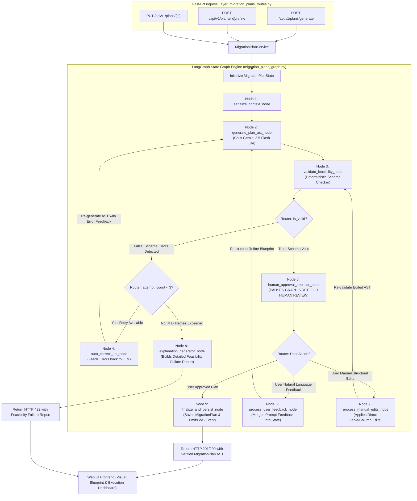

# LangGraph Stateful Agent Architecture Guide (`LANGGRAPH_ARCHITECTURE.md`)

This document provides a comprehensive architectural and educational guide for the **LangGraph Stateful Agent Plan Refinement & Feasibility Validation Engine** powering Phase 5 of **Migraflow**.

---

## 📐 1. System Vision & Architecture

The AI Migration Planning process is inherently **non-linear, iterative, and stateful**. A single static LLM prompt is insufficient because:
1. **AI Output Uncertainty**: An initial LLM output might contain minor schema inaccuracies (e.g. referencing a column name that doesn't exist).
2. **Human-in-the-Loop Feedback**: Database administrators must be able to inspect blueprints, rename target tables, adjust column mappings, or provide natural language instructions (*"drop password_hash and use left_join for db_2"*).
3. **Feasibility Validation**: If a user's proposed mapping is technically impossible (e.g. mapping incompatible data types without conversion rules), the system must **detect the impossibility and explain clearly WHY the database cannot be migrated with those settings**.

To solve these requirements, we use **LangGraph** (`langgraph`) to model plan generation, deterministic schema checking, auto-correction loops, human interrupts, and plan refinement as an explicit **State Graph** (`StateGraph`).

---

## 📊 2. Comprehensive LangGraph State Graph Diagram



---

## 🧠 3. Step-by-Step Node & Router Breakdown

### `MigrationPlanState` (Central Graph State)

The `MigrationPlanState` dictionary is the single source of truth passed across all nodes during the graph execution:

```python
class MigrationPlanState(TypedDict):
    agent_id: str
    user_id: str
    target_db_type: str
    custom_instructions: Optional[str]
    context_yaml: str
    snapshots: List[Any]
    alias_map: Dict[str, str]
    current_ast: Optional[Dict[str, Any]]
    validation_result: Optional[Dict[str, Any]]
    user_feedback: Optional[str]
    manual_edits: Optional[Dict[str, Any]]
    attempt_count: int
    is_approved: bool
    feasibility_explanation: Optional[str]
    persisted_plan_id: Optional[str]
```

---

### Node-by-Node Responsibilities

#### **Node 1: `serialize_context_node`**
- **Role**: Takes the agent's attached data source `MetadataSnapshot` trees and runs `MetadataContextSerializer.serialize()`.
- **Output**: Produces a sanitized, Zero-Raw-Data YAML context string containing table structures, data types, column ordinal positions, primary keys, foreign keys, and optional user `custom_instructions`.

#### **Node 2: `generate_plan_ast_node`**
- **Role**: Invokes Google Gemini 3.5 Flash Lite via `ChatGoogleGenerativeAI`.
- **Functionality**:
  - On **initial run**: Generates a complete `TransformationPlanAST` (target DDL SQL, table mappings, column type casts, deduplication rules).
  - On **refinement run**: Receives previous AST + natural language user feedback and generates a refined AST blueprint.
- **Output**: Sets `state["current_ast"]`.

#### **Node 3: `validate_feasibility_node`**
- **Role**: Executes the **Deterministic Schema Validator** (`MigrationPlanValidator`).
- **Functionality**: Performs a multi-stage feasibility check against introspected metadata snapshots:
  1. **Stage 0 (Empty Mappings Check)**: Validates that `table_mappings` contains at least 1 table mapping, failing validation if empty.
  2. **Stage A (Source Table & Schema Existence Check)**: Verifies all referenced source database aliases and tables exist in snapshot metadata.
  3. **Stage B (Source Column & Type Conversion Check)**: Verifies source columns exist, checks type compatibility, enforces **Target Column Collision Checks** (flags duplicate `target_column_name` entries within the same table mapping as errors), and performs **Concatenation Length-Overflow Checks** (warns when `merge_concat` combined source max lengths exceed `varchar(N)` target max length constraints).
  4. **Stage C (Primary Key & Deduplication Key Validity Check)**: Ensures deduplication keys map to valid target columns.
  5. **Stage D (Foreign Key & DDL Two-Phase Hygiene & Pre-DDL Resolution Check)**: Enforces that foreign keys execute in `post_migration_ddl` after data streaming completes. Automatically parses `CREATE TABLE` DDL statements in `pre_migration_ddl` to register newly created target tables in the validation set.
  6. **Stage D2 (Circular Foreign Key Cycle Detection Check)**: Constructs a directed graph of post-migration foreign key dependencies and runs DFS cycle detection, emitting architecture warning notices when circular FK cycles are detected.
  7. **Stage E (Architecture Standards & PK Rekey Remap Warnings)**: Checks lowercase snake_case naming conventions and warns when multi-source table merges rekey primary keys while foreign key dependent tables exist.
- **Output**: Sets `state["validation_result"]` with `is_valid: bool`, `errors: List[str]`, `warnings: List[str]`.

#### **Router 1: `check_validation_router` (Conditional Edge)**
- Inspects `state["validation_result"]["is_valid"]`:
  - If `True` $\rightarrow$ Routes to **Node 5 (`human_approval_interrupt_node`)**.
  - If `False` $\rightarrow$ Routes to **Retry Router**.

#### **Node 4: `auto_correct_ast_node`**
- **Role**: **Self-Correction Loop**.
- **Functionality**: Takes the specific validation errors generated by Node 3, formats them into a corrective prompt, increments `attempt_count`, and feeds them back into Node 2 so Gemini can fix the AST before presenting it to the user.

#### **Node 5: `human_approval_interrupt_node`**
- **Role**: **Human-in-the-Loop Pause Point**.
- **Functionality**: Uses LangGraph's native `interrupt()` capability to **pause execution state**.
- **State Behavior**: The graph serializes its state to PostgreSQL memory checkpointer. The API returns the valid AST blueprint to the Web UI for human review.

#### **Router 2: `human_feedback_router` (Conditional Edge)**
- When the user interacts with the Web UI:
  - If user clicks **"Approve & Start Migration"** $\rightarrow$ Routes to **Node 9 (`finalize_and_persist_node`)**.
  - If user types natural language feedback (*"rename table to customer_accounts"*) $\rightarrow$ Routes to **Node 6 (`process_user_feedback_node`)**.
  - If user manually edits table/column mappings in UI $\rightarrow$ Routes to **Node 7 (`process_manual_edits_node`)**.

#### **Node 6: `process_user_feedback_node`**
- **Role**: Merges natural language prompt feedback into `state["user_feedback"]` and re-routes back to **Node 2 (`generate_plan_ast_node`)** for Gemini re-generation.

#### **Node 7: `process_manual_edits_node`**
- **Role**: Applies user's manual UI modifications to `state["current_ast"]` and re-routes to **Node 3 (`validate_feasibility_node`)** for instant re-validation.
- **Merge Strategy**: Executes a **Deep Structural Identity Merge** keyed by `target_table_name` and `target_column_name`. If a partial edit payload is submitted touching only 1 table or 1 column, all unedited tables in `table_mappings` and unedited columns in `column_mappings` remain present and unchanged (preventing shallow merge data loss).

#### **Node 8: `explanation_generator_node`**
- **Role**: **Feasibility Failure Reporter**.
- **Functionality**: When a user's proposed plan or edit is technically impossible and cannot be auto-corrected after 3 attempts, this node constructs a human-readable diagnostic explanation detailing **why the database cannot be migrated with those settings**.

#### **Node 9: `finalize_and_persist_node`**
- **Role**: **Final Plan Persistence & Version Snapshotting**.
- **Functionality**: Saves the verified, human-approved `MigrationPlan` ORM entity to PostgreSQL DB, sets `status = 'completed'` (or `'approved'`), initializes `plan.current_version = 1`, and automatically persists the initial immutable `MigrationPlanVersion(version_number=1, comment="Initial AI generated plan blueprint", plan_data=...)` snapshot. Emits WebSocket event `PLAN_GENERATED`.
- **Iterative Refinements & Rollbacks**: Subsequent user refinements (via Node 6) or approved manual edits (via Node 7) automatically increment `version_number` and archive new version snapshots, enabling full audit history and zero-downtime rollbacks via `POST /api/v1/plans/{id}/versions/{version_number}/restore`.

---

## ⚡ 4. Key Architectural Takeaways for Learning LangGraph

1. **State Centralization**: Everything flows through `MigrationPlanState`. Nodes are simple Python functions that read state and return modified keys.
2. **Determinism + AI Synergy**: Deterministic Python code (`MigrationPlanValidator`) acts as a guardrail around the non-deterministic LLM (`Gemini`).
3. **No Code Sprawling**: Complex loop logic, retries, and human pause points are declared cleanly using LangGraph's `add_node()`, `add_edge()`, and `add_conditional_edges()`.
4. **Stateful Persistence**: LangGraph's checkpointer persists state across separate HTTP API calls, enabling seamless Human-in-the-Loop workflows.
5. **Row-Level Concurrency Locks**: Concurrent plan refinements are protected by PostgreSQL `with_for_update()` row-level locks on `MigrationPlan` entities in `migration_plans_services.py` to prevent race conditions during iterative state transitions.
6. **Immutable Plan Version Snapshots**: State transitions that alter the plan AST are persisted not only in the ephemeral LangGraph runtime checkpointer, but also as durable, relational `MigrationPlanVersion` rows (`migration_plan_versions` table). This provides users with auditability, read-only preview of previous plan versions, and the ability to roll back the active blueprint at any time.
